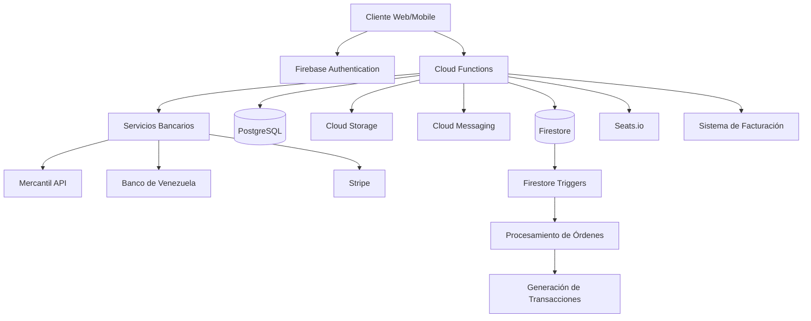
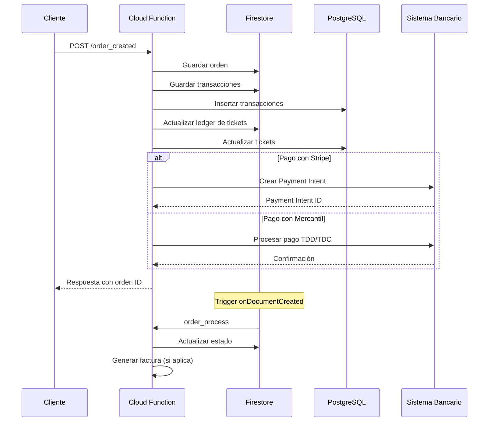

## Visión General

TMT es un sistema completo de gestión de tickets para eventos construido sobre Firebase Cloud Functions. El sistema proporciona una arquitectura serverless escalable que integra múltiples servicios y bases de datos.

<Info>
  TMT utiliza una arquitectura híbrida que combina Firestore para datos transaccionales en tiempo real y PostgreSQL para análisis y consultas complejas.
</Info>

## Stack Tecnológico

Basado en `package.json:11-32`, TMT está construido con:

- **Runtime**: Node.js 22
- **Framework**: Firebase Cloud Functions v2
- **Autenticación**: Firebase Authentication
- **Bases de datos**: 
  - Firestore (NoSQL)
  - PostgreSQL (SQL mediante Google Cloud SQL Connector)
- **Pagos**: Stripe, Mercantil, Banco de Venezuela
- **Gestión de asientos**: Seats.io
- **Notificaciones**: Firebase Cloud Messaging
- **Storage**: Firebase Cloud Storage

## Arquitectura de Alto Nivel



## Estructura Modular

El código fuente está organizado en una estructura modular que refleja las diferentes funcionalidades del sistema:

### Configuración (`config/`)

Archivos de configuración centralizados:

- **`config.js`**: Inicialización de Firebase Admin SDK y configuración global
  ```javascript
  const admin = require("firebase-admin");
  admin.initializeApp();
  
  const auth = admin.auth();
  const db = admin.firestore();
  const storage = admin.storage();
  const messaging = admin.messaging();
  ```

- **`dbpostgres.js`**: Conector para PostgreSQL usando Google Cloud SQL Connector
  - Proporciona función `sqltmt()` para operaciones SQL (SELECT, INSERT, UPDATE, DELETE)
  - Maneja pool de conexiones automáticamente
  - Soporta consultas parametrizadas con WHERE, GROUP BY, ORDER BY

- **`encryption.js`**: Utilidades de encriptación/desencriptación
  - AES-256-CBC para datos sensibles
  - AES-128-ECB para integraciones bancarias
  - Funciones: `encrypt()`, `decrypt()`, `encryptAES256()`, `decryptAES256()`

### Módulos Funcionales (`functions/`)

#### 1. Gestión de Usuarios (`users/`)

Maneja todos los tipos de usuarios del sistema:

- **`create_client.js`**: Crea usuarios tipo cliente (empresas)
- **`create_collaborator.js`**: Crea colaboradores asociados a clientes
- **`create_staff.js`**: Crea personal administrativo
- **`validate_user.js`**: Validación de usuarios por plataforma y tipo
- **`update_user.js`**: Actualización de email y contraseña

<Note>
  Los usuarios se crean primero en Firebase Authentication y luego se almacena información adicional en Firestore en colecciones específicas (`u_clients`, `u_collaborators`, `u_staff`).
</Note>

#### 2. Eventos (`events/`)

Submódulos para gestión completa de eventos:

**Tickets (`events/tickets/`):**
- `tickets_generate.js`: Generación masiva de tickets
- Listado de tickets por evento
- Bloqueo/desbloqueo de tickets
- Control de acceso (entrada/salida)

**Estado de Eventos (`events/status/`):**
- `event_instantiated.js`: Evento creado
- `event_active.js`: Evento activo
- `event_in_progress.js`: Evento en curso
- `event_finished.js`: Evento finalizado
- `event_cancelled.js`: Evento cancelado

**Estado de Tickets (`events/status/`):**
- `tickets_reserved.js`: Tickets reservados
- `tickets_blocked.js`: Tickets bloqueados
- `tickets_sold.js`: Tickets vendidos
- `tickets_verified.js`: Tickets verificados
- `tickets_assigned.js`: Tickets asignados
- `tickets_expired.js`: Tickets expirados

**Taquillas:**
- `virtual_office/`: Gestión de taquillas virtuales
- `offline_office/`: Taquillas sin conexión (modo frío)
- `control_access/`: Control de acceso al evento

**Utilidades:**
- `helpers/`: Generación de PINs, envío de emails y notificaciones

#### 3. Órdenes y Transacciones

**Órdenes (`orders/order.js`):**
Basado en `functions/orders/order.js:1-100`:

- `order_created`: Crea nuevas órdenes (HTTP endpoint)
- `order_process`: Trigger que se activa al crear una orden
- `order_update`: Actualiza órdenes existentes
- `order_payout`: Gestiona pagos a clientes
- `process_order_billing`: Genera facturación automática

Estructura de una orden:
```javascript
{
  amount: Number,
  date: { created: Timestamp, updated: Timestamp },
  event_id: String,
  event_name: String,
  office_id: String,
  office_name: String,
  status: String,
  status_type: { id: String, name: String },
  tickets: Array,
  transactions: Array,
  client_id: String,
  client_name: String,
  exchange_rate: Number,
  box_office_name: String,
  box_office_id: String,
  purchaser_info: Object
}
```

**Transacciones (`transactions/transactions.js`):**
Basado en `functions/transactions/transactions.js:31-80`:

- Genera transacciones asociadas a órdenes
- Actualiza ledger de tickets
- Sincroniza datos entre Firestore y PostgreSQL
- Gestiona cuentas de custodia

#### 4. Integraciones Bancarias (`banking/`)

**Mercantil (`banking/mercantil/`):**
- `api_mercantil.js`: Integración con API de Banco Mercantil
- Soporte para tarjetas de débito/crédito (TDD/TDC)
- Pagos C2P (cliente a persona)
- Autenticación y búsqueda de transacciones

**Banco de Venezuela (`banking/bancodevenezuela/`):**
- `check_pagomovil.js`: Verificación de Pago Móvil
- `conciliation_bdv.js`: Conciliación bancaria

**Stripe (`banking/stripe/`):**
- `api_stripe.js`: Pagos internacionales
- Payment Intents
- Webhooks para confirmación de pagos

#### 5. Conciliación (`conciliation/`)

Sistema complejo de conciliación bancaria:

- `conciliation_process.js`: Proceso principal de conciliación
- Carga de transacciones TMT y bancarias
- Identificación de transacciones conciliadas y no conciliadas
- Generación de reportes y resúmenes
- Ajustes manuales

#### 6. Custodia (`custody/`)

- `custody_process.js`: Gestión de cuentas de custodia
- Seguimiento de fondos entre clientes, TMT y bancos
- Procesamiento de retiros y depósitos

#### 7. Facturación (`billing/`)

- `billing.js`: Integración con sistema de facturación TFHKA
- Emisión automática de facturas
- Generación de facturas desde gastos

#### 8. Indicadores (`indicators/`)

Generación de métricas y KPIs del sistema:

- Distribución de dinero
- Tickets vendidos vs disponibles
- Ventas por taquilla
- Datos generales de la plataforma
- Ventas totales por cliente
- Tipos de colaboradores

#### 9. Integraciones Externas

**Seats.io (`seatsio/`):**
- Creación y gestión de eventos
- Gestión de charts (mapas de asientos)
- Hold/release de asientos
- Reserva y venta de asientos

**Portales (`portals/`):**
- Listado de eventos para clientes
- APIs públicas para integraciones

**App de Usuarios (`app_users/`):**
- Validación de usuarios de la app móvil
- Listado de órdenes y tickets
- Transferencia de tickets
- Transferencias offline

## Flujo de Datos

### Flujo de Creación de Orden



### Flujo de Generación de Tickets

Basado en `functions/events/tickets/tickets_generate.js:28-80`:

1. Se lee la configuración del evento desde Firestore
2. Se obtienen las zonas configuradas (setup/zones)
3. Para cada zona, se generan N tickets según la cantidad de asientos
4. Cada ticket se crea con:
   - ID único: `{event_id}-{generated_id}`
   - Seat ID: `{zone_id}-{seat_number}`
   - Ledger inicial con acción "generated"
   - Timestamps de creación
5. Los tickets se guardan en Firestore y PostgreSQL

## Base de Datos Dual

### Firestore (Primaria)

**Ventajas:**
- Actualizaciones en tiempo real
- Escalabilidad automática
- Triggers y funciones reactivas
- Estructura flexible

**Colecciones principales:**
- `u_clients`: Usuarios tipo cliente
- `u_collaborators`: Colaboradores
- `u_staff`: Personal administrativo
- `events`: Eventos y su configuración
- `tickets`: Tickets individuales
- `orders`: Órdenes de compra
- `orders_transactions`: Transacciones
- `custody_accounts`: Cuentas de custodia

### PostgreSQL (Secundaria)

Basado en `config/dbpostgres.js:1-48`:

**Ventajas:**
- Consultas SQL complejas
- Joins eficientes
- Agregaciones y reportes
- Integridad referencial

**Uso:**
- Réplica de datos críticos de Firestore
- Generación de reportes e indicadores
- Conciliación bancaria
- Análisis histórico

**Función helper:**
```javascript
await sqltmt(
  "select",              // tipo: select, insert, update, delete
  "tickets",             // tabla
  "ledger, ticket_id",  // campos
  "ticket_id in('...')", // where
  null,                  // limit
  null,                  // offset
  null,                  // orderby
  null,                  // valores (para insert)
  null                   // groupby
);
```

## Registro de Funciones

Todas las Cloud Functions se exportan desde `index.js:1-196`, que sirve como punto de entrada central:

```javascript
// Ejemplo de registro
const client = require("./functions/users/create_client");
exports.create_client = client.create_client;

const orders = require("./functions/orders/order");
exports.order_created = orders.order_created;
exports.order_process = orders.order_process;
```

<Info>
  Este patrón centralizado facilita el despliegue y versionado de todas las funciones.
</Info>

## Seguridad y Autenticación

### Firebase Authentication

- Todos los usuarios (clientes, colaboradores, staff) se crean en Firebase Auth
- Se utilizan custom claims para roles y permisos
- Session IDs para control de sesiones concurrentes

### CORS

Todas las funciones HTTP implementan CORS:
```javascript
const cors = require("cors")({ origin: "*" });

exports.function_name = functions.https.onRequest((req, res) => {
  cors(req, res, async () => {
    // Lógica de la función
  });
});
```

<Warning>
  En producción, el origen CORS debería estar restringido a dominios específicos en lugar de usar `"*"`.
</Warning>

### Encriptación

Datos sensibles se encriptan usando `config/encryption.js:1-78`:

- **AES-256-CBC**: Para datos generales sensibles
- **AES-128-ECB**: Para integraciones bancarias específicas
- Claves almacenadas como variables de entorno

## Triggers y Procesamiento Asíncrono

### Firestore Triggers

Basado en `functions/orders/order.js:1-10`:

```javascript
const {
  onDocumentWritten,
  onDocumentCreated,
  onDocumentUpdated,
  onDocumentDeleted
} = require("firebase-functions/v2/firestore");

// Se activa cuando se crea una orden
exports.order_process = onDocumentCreated(
  "orders/{orderId}",
  async (event) => {
    // Procesamiento automático
  }
);
```

### Batch Operations

Para operaciones masivas eficientes:
```javascript
var batch = db.batch();

// Agregar múltiples operaciones
batch.set(docRef1, data1);
batch.update(docRef2, data2);
batch.delete(docRef3);

// Ejecutar todas las operaciones
await batch.commit();
```

## Integración con Data Connect

TMT utiliza Firebase Data Connect para queries tipadas:

```javascript
const { getDataConnect, executeMutation } = require('firebase/data-connect');
const dataconnect = require('../../dataconnect-tmt-generated');
```

## Escalabilidad y Rendimiento

### Cloud SQL Connector

Manejo eficiente de conexiones PostgreSQL:
```javascript
const {Connector} = require('@google-cloud/cloud-sql-connector');
const connector = new Connector();

const clientOpts = await connector.getOptions({
  instanceConnectionName: 'project:region:instance',
  ipType: 'PUBLIC',
});

const pool = new Pool({
  ...clientOpts,
  max: 5  // Pool de conexiones
});
```

### Timestamps Consistentes

Uso de `moment.js` para formateo consistente:
```javascript
const moment = require('moment');
const date_created = moment(Timestamp.now().toDate()).format();
```

## Monitoreo y Logging

Las funciones usan `console.log` que se integra con Cloud Logging:

```javascript
console.log('Successfully created new user:', userRecord.uid);
console.error('Error creating new user:', error);
```

<Tip>
  Usa Firebase Functions logs para debugging:
  ```bash
  firebase functions:log
  ```
</Tip>

## Despliegue

Configuración en `package.json:4-9`:

```json
{
  "scripts": {
    "serve": "firebase emulators:start --only functions",
    "deploy": "firebase deploy --only functions",
    "logs": "firebase functions:log"
  }
}
```

### Desarrollo Local
```bash
npm run serve
```

### Despliegue a Producción
```bash
npm run deploy
```

## Próximos Pasos

<CardGroup cols={2}>
  <Card title="Gestión de Usuarios" icon="users" href="/auth/users">
    Explora las APIs de usuarios en detalle
  </Card>
  <Card title="Sistema de Eventos" icon="calendar" href="/modules/events">
    Aprende a crear y gestionar eventos
  </Card>
  <Card title="Procesamiento de Pagos" icon="credit-card" href="/payments/overview">
    Integra métodos de pago
  </Card>
  <Card title="Referencia de API" icon="code" href="/api/users/create-client">
    Consulta toda la documentación de API
  </Card>
</CardGroup>