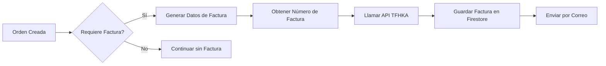

# Sistema de Facturación

TMT incluye un sistema completo de facturación digital integrado con **TFHKA** (The Factory HKA) para la emisión automática de facturas electrónicas. El sistema se activa automáticamente durante el procesamiento de órdenes cuando se cumplen las condiciones configuradas.

## Integración con TFHKA

El sistema de facturación se conecta con el servicio externo de TFHKA para:

- Emitir facturas electrónicas válidas
- Anular documentos fiscales
- Aplicar retenciones
- Enviar facturas por correo electrónico
- Rastrear el estado de las facturas

<Info>
TFHKA es un proveedor de facturación digital que cumple con las normativas fiscales venezolanas para la emisión de facturas electrónicas.
</Info>

## Arquitectura de Facturación



<CardGroup cols={2}>
  <Card title="Facturación Digital" icon="file-invoice" href="/billing/digital-invoicing">
    Aprende cómo funciona la emisión automática
  </Card>
  <Card title="API de Facturación" icon="code" href="/api/integrations/billing">
    Referencia completa de los endpoints
  </Card>
</CardGroup>

## Funciones Disponibles

El módulo de facturación expone las siguientes funciones de Firebase:

### Emisión de Documentos

- **`billing_emision`**: Emite una factura electrónica a través de TFHKA
- **`generateBillingFromExpenses`**: Genera facturas basadas en gastos registrados
- **`process_order_billing`**: Integrado en el flujo de órdenes para facturación automática

### Gestión de Documentos

- **`anularDocumento`**: Anula una factura previamente emitida
- **`aplicarRetencion`**: Aplica retenciones fiscales a documentos
- **`descargaArchivo`**: Descarga el PDF de una factura emitida

### Numeración

- **`asignarNumeraciones`**: Asigna rangos de numeración para facturas
- **`consultaNumeraciones`**: Consulta las numeraciones disponibles
- **`getNextInvoiceNumber`**: Obtiene el siguiente número de factura secuencial

### Correos

- **`correoEnviar`**: Envía facturas por correo electrónico
- **`correoRastreo`**: Rastrea el estado de envío de correos

## Autenticación con TFHKA

Todas las llamadas al API de TFHKA requieren autenticación JWT:

```javascript
// Obtener token de autenticación
async function fetchAuthToken() {
  const response = await axios.post(
    `${BASE_URL}/api/Autenticacion`,
    {
      usuario: USER,
      clave: PASSWORD
    }
  );
  return response.data.token;
}
```

<Warning>
Las credenciales de autenticación (`USER` y `PASSWORD`) deben configurarse en las variables de entorno del proyecto. Nunca las incluyas directamente en el código.
</Warning>

## Estructura de Datos de Factura

```javascript
{
  controlNumero: "0001-00000001",
  tipoDocumentoId: 1,
  fecha: "2024-03-13",
  observacion: "Venta de boletos para evento",
  cliente: {
    tipoDocumentoId: "J",
    documentoId: "123456789",
    razonSocial: "EMPRESA EJEMPLO C.A.",
    direccion: "Caracas, Venezuela",
    telefono: "0212-1234567",
    email: "cliente@ejemplo.com"
  },
  detalles: [
    {
      tipoItemId: 1,
      codigoItem: "TICKET-001",
      descripcion: "Boleto Zona VIP",
      cantidad: 2,
      precioUnitario: 50.00,
      descuento: 0,
      montoImpuesto: 8.00
    }
  ],
  totalNeto: 100.00,
  totalImpuesto: 16.00,
  totalGeneral: 116.00,
  moneda: "VES"
}
```

## Flujo de Facturación Automática

<Steps>
  <Step title="Orden procesada">
    Cuando una orden es procesada con `order_process`, el sistema verifica si requiere facturación
  </Step>
  <Step title="Validar cliente">
    Se valida que el cliente tenga toda la información fiscal necesaria (RIF, dirección, etc.)
  </Step>
  <Step title="Generar datos">
    Se genera la estructura de datos de factura a partir de los detalles de la orden
  </Step>
  <Step title="Obtener numeración">
    Se obtiene el siguiente número de control de factura disponible
  </Step>
  <Step title="Emitir factura">
    Se llama a la API de TFHKA para emitir la factura electrónica
  </Step>
  <Step title="Guardar respuesta">
    Se guarda la respuesta de TFHKA en Firestore con el estado de la factura
  </Step>
  <Step title="Enviar por correo">
    Se envía automáticamente la factura al correo del cliente
  </Step>
</Steps>

## Estados de Factura

Las facturas pueden tener los siguientes estados:

- **`pending`**: Factura pendiente de emisión
- **`emitted`**: Factura emitida exitosamente
- **`sent`**: Factura enviada por correo
- **`failed`**: Error en la emisión de la factura
- **`annulled`**: Factura anulada

## Manejo de Errores

El sistema de facturación incluye manejo robusto de errores:

```javascript
try {
  const data = await callApi("/api/Emision", billingData);
  return { success: true, data };
} catch (error) {
  console.error("Error en emisión de factura:", error);
  return {
    success: false,
    error: error.response?.data || error.message,
    validaciones: error.config?.data?.validaciones
  };
}
```

<Note>
Cuando una factura falla, el error se registra pero la orden no se cancela. Esto permite procesar el pago y emitir la factura posteriormente de forma manual.
</Note>

## Configuración Requerida

Para usar el sistema de facturación, debes configurar:

1. **Credenciales TFHKA**: Usuario y contraseña del servicio
2. **URL del API**: URL base del servicio de TFHKA (producción o demo)
3. **Datos fiscales**: Información fiscal completa de tu empresa
4. **Numeración**: Rangos de numeración autorizados por SENIAT

## Próximos Pasos

<CardGroup cols={2}>
  <Card title="Facturación Digital" icon="book" href="/billing/digital-invoicing">
    Implementa facturación en tus órdenes
  </Card>
  <Card title="API Reference" icon="code" href="/api/integrations/billing">
    Explora todos los endpoints disponibles
  </Card>
</CardGroup>
