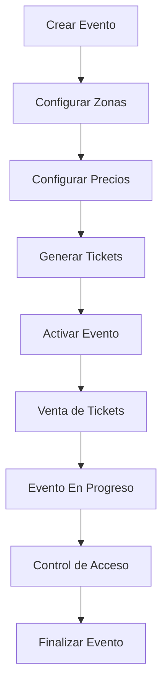

## Descripción General

El módulo de **Eventos** es el núcleo del sistema TMT. Gestiona el ciclo de vida completo de eventos, desde su creación hasta su finalización, incluyendo la configuración de zonas, precios, y el seguimiento de estados.

<Info>
  Los eventos en TMT se almacenan en la colección `events` de Firestore y se sincronizan con PostgreSQL para consultas optimizadas.
</Info>

## Estructura de Datos

### Evento Principal

```javascript
{
  date: {
    created: Timestamp,
    updated: Timestamp
  },
  date_start: Timestamp,
  date_end: Timestamp,
  event: {
    name: string,
    description: string
  },
  status: string, // "Activo", "Finalizado", "Cancelado", "En Progreso"
  // Contadores
  counter_transactions: number,
  counter_tickets: number
}
```

### Configuración de Zonas

Los eventos tienen una subcolección `setup` que contiene la configuración de zonas:

```javascript
// Ruta: events/{eventId}/setup/zones
{
  status: boolean,
  seats_allocated: number,
  zone: [
    {
      id: string,
      name: string,
      color: string,
      seats: number,
      description: string
    }
  ]
}
```

### Configuración Financiera

Cada evento tiene configuración de costos fijos y variables:

```javascript
// Ruta: events/{eventId}/setup/financial
{
  fixed_cost_balance: number,
  fixed_cost_collected: number,
  costs_fixed: [
    {
      name: string,
      value_total: number
    }
  ],
  costs_variables: [
    {
      name: string,
      entity: string, // "TMT" o "Cliente"
      value: number // Porcentaje
    }
  ]
}
```

## Funciones Principales

### Actualización Automática de Estados

El sistema actualiza automáticamente el estado de los eventos cuando finaliza su fecha:

```javascript helpers.js:373
exports.update_events_status = functions.https.onRequest(async (req, res) => {
  let date_comp = Timestamp.now();
  await db.collection("events")
    .where("date_end", "<", date_comp)
    .orderBy("date_end", "asc")
    .get()
    .then(async (snapshot) => {
      if(snapshot._size > 0){
        snapshot.forEach(async (doc) => {
          let data = doc.data();
          if(data.status == "Activo"){
            await db.collection("events").doc(doc.id)
              .update({
                "status": "Finalizado",
                "date.updated": Timestamp.now()
              });
          }
        });
      }
    });
});
```

### Seguridad y PIN de Eventos

Cada evento puede tener un PIN de seguridad para control de acceso:

```javascript helpers.js:40
exports.helpers_event_pin = functions.https.onRequest(async (req, res) => {
  let event_id = req.body.data.event_id;
  await db.collection("events").doc(event_id)
    .collection("security").doc("qr-pin")
    .get()
    .then(async (snapshot) => {
      let data = snapshot.data();
      if(data){
        res.send({ 
          message: "Evento Encontrado", 
          status: 200, 
          data: {qr_pin: data.data} 
        });
      }
    });
});
```

## Estados del Evento

<Steps>
  <Step title="Instanciado">
    Evento creado en el sistema con configuración básica.
  </Step>
  
  <Step title="Activo">
    Evento listo para venta de tickets. Se generan los tickets según las zonas configuradas.
  </Step>
  
  <Step title="En Progreso">
    El evento ha comenzado, se activa el control de acceso.
  </Step>
  
  <Step title="Finalizado">
    El evento ha terminado. Se actualiza automáticamente cuando `date_end < now()`.
  </Step>
  
  <Step title="Cancelado">
    Evento cancelado, se pueden procesar reembolsos.
  </Step>
</Steps>

## Sistema de Notificaciones

El módulo incluye funcionalidad para enviar notificaciones push a usuarios que compraron tickets:

```javascript helpers.js:193
exports.send_notifications = functions.https.onRequest(async (req, res) => {
  let event_id = req.body.data.event_id;
  let title = req.body.data.title;
  let body = req.body.data.body;
  let icono = req.body.data.icono;
  
  await db.collection("u_users")
    .where("fcmToken", "!=", " ")
    .get()
    .then(async (snapshot) => {
      snapshot.forEach(async (data) => {
        let data_order = data.data();
        // Verifica si el usuario tiene órdenes para este evento
        await db.collection("u_users").doc(data.id).collection("orders")
          .where("event_id", "==", event_id)
          .get()
          .then(async (orders) => {
            if (orders._size > 0) {
              // Envía notificación usando Firebase Messaging
              fmcTokens.push(data_order.fcmToken);
            }
          });
      });
    });
});
```

<Note>
  Las notificaciones se envían en lotes de 100 tokens por motivos de rendimiento y límites de Firebase Messaging.
</Note>

## Flujo de Trabajo Típico



## Subcolecciones

Cada evento tiene las siguientes subcolecciones:

<CardGroup cols={2}>
  <Card title="tickets" icon="ticket">
    Todos los tickets generados para el evento
  </Card>
  
  <Card title="setup" icon="gear">
    Configuración de zonas, precios y aspectos financieros
  </Card>
  
  <Card title="offices" icon="building">
    Taquillas y puntos de venta asignados
  </Card>
  
  <Card title="security" icon="shield">
    PINs y configuración de seguridad
  </Card>
</CardGroup>

## Envío de Correos

El sistema integra Brevo (SendInBlue) para envío de correos:

```javascript helpers.js:145
exports.send_email = functions.https.onRequest(async (req, res) => {
  let to_email = req.body.data.to_email;
  let to_name = req.body.data.to_name;
  let html_send = req.body.data.html_send;
  let subject = req.body.data.subject;
  
  let data = JSON.stringify({
    "sender": {
      "name": "TMT",
      "email": "carticket@trademastertransactions.com"
    },
    "to": [{
      "email": to_email,
      "name": to_name
    }],
    "htmlContent": html_send,
    "subject": subject
  });
  
  axios.request(config)
    .then((response) => {
      res.send({ 
        message: "enviado", 
        status: 200, 
        data: {valido: true, mensaje: response.data} 
      });
    });
});
```

## Consulta de Notificaciones

```javascript helpers.js:323
exports.list_notifications = functions.https.onRequest(async (req, res) => {
  let uid = req.body.data.uid;
  let event_id = req.body.data.event_id;
  let from = req.body.data.from;
  let to = req.body.data.to;
  
  const listado_not = await dbpostgres.sqltmt(
    "select", 
    "notifications_send_detail nd, notifications_send n", 
    "*", 
    where, 
    null, null, null, null, null
  );
});
```

<Warning>
  Las notificaciones se almacenan en PostgreSQL para permitir consultas complejas y reportes históricos.
</Warning>

## API Relacionadas

<CardGroup cols={2}>
  <Card title="Generar Tickets" icon="ticket" href="/api/events/tickets-generate">
    Genera todos los tickets del evento
  </Card>
  <Card title="Actualizar Estado" icon="arrows-rotate" href="/modules/events">
    Actualiza el estado del evento
  </Card>
  <Card title="Enviar Notificaciones" icon="bell" href="/modules/events">
    Envía notificaciones a usuarios
  </Card>
  <Card title="Obtener PIN" icon="key" href="/modules/events">
    Obtiene el PIN de acceso del evento
  </Card>
  
  <Card title="Actualizar Estado" icon="arrows-rotate" href="/modules/events">
    Actualiza el estado de eventos finalizados
  </Card>
  
  <Card title="Enviar Notificaciones" icon="bell" href="/modules/events">
    Envía notificaciones push a compradores
  </Card>
  
  <Card title="Obtener PIN" icon="key" href="/modules/events">
    Obtiene el PIN de seguridad del evento
  </Card>
</CardGroup>

## Próximos Pasos

<CardGroup cols={2}>
  <Card title="Módulo de Tickets" icon="ticket" href="/modules/tickets">
    Aprende sobre la generación y gestión de tickets
  </Card>
  
  <Card title="Módulo de Órdenes" icon="cart-shopping" href="/modules/orders">
    Descubre cómo se procesan las órdenes de compra
  </Card>
</CardGroup>