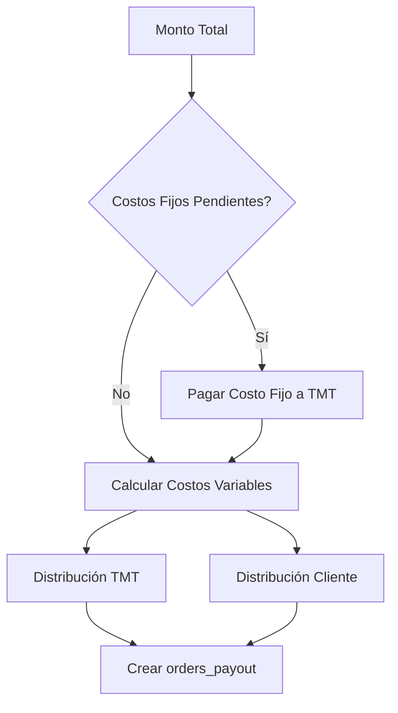
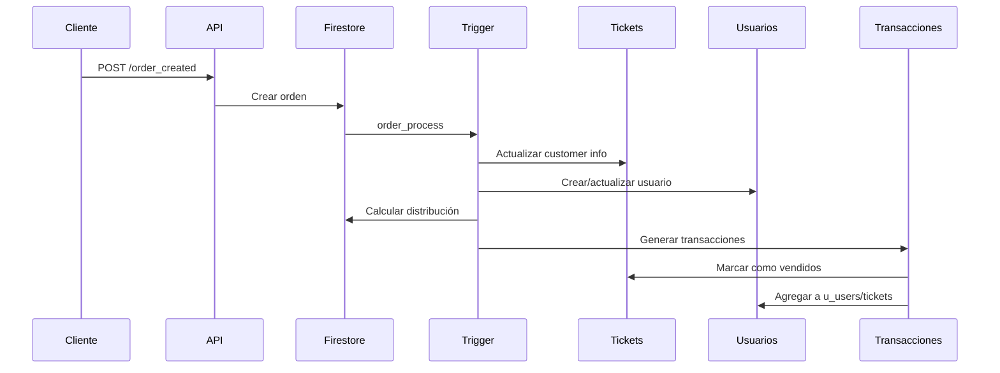

## Descripción General

El módulo de **Órdenes** gestiona todo el proceso de compra de tickets, desde la creación de la orden hasta la distribución automática de pagos entre TMT y el cliente. Incluye integración con el sistema de facturación y gestión de usuarios.

<Info>
  Las órdenes se crean en Firestore y disparan triggers automáticos que procesan transacciones, actualizan tickets y generan distribuciones de pago.
</Info>

## Estructura de Datos de la Orden

```javascript
{
  amount: number,              // Monto total en moneda base
  date: {
    created: Timestamp,
    updated: Timestamp
  },
  
  // Información del evento
  event_id: string,
  event_name: string,
  
  // Información de la oficina
  office_id: string,
  office_name: string,
  box_office_id: string,
  box_office_name: string,
  
  // Cliente (organizador del evento)
  client_id: string,
  client_name: string,
  
  // Estado
  status: boolean,
  status_type: {
    id: string,               // "completed", "pending", "cancelled"
    name: string
  },
  
  // Tasa de cambio
  exchange_rate: number,
  
  // Tickets incluidos en la orden
  tickets: [
    {
      id: string,
      ticket_id: string,
      amount: number,
      status: boolean,
      metadata: {
        customer_email: string,
        customer_id: string,
        customer_name: string,
        customer_phone: string,
        customer_address: string,
        customer_country: {
          code: string,
          name: string,
          key: number
        },
        customer_id_type: string
      }
    }
  ],
  
  // Transacciones de pago
  transactions: [
    {
      amount: number,
      custody_account: {
        id: string,
        name: string,
        account_number: string
      },
      payment_id: string,
      payment_name: string,
      payment_data: object,
      status: boolean,
      date: { created: Timestamp },
      amount_currency: string,    // "USD", "VEF"
      amount_exchange: number,
      amount_exchange_rate: number,
      point_sale_tmt: boolean     // true si es punto de venta TMT
    }
  ],
  
  // Distribución de pagos (calculada automáticamente)
  distribution: [
    {
      payout_id: string,
      amount: number,
      description: string,        // "Pago Costo Fijo" o "Pago Costo Variable"
      entity: string              // "TMT" o "Cliente"
    }
  ],
  
  // Información de facturación
  billing_info: {
    billed: boolean,
    billing_date: Timestamp,
    billing_result: object
  },
  
  // Información del comprador
  purchaser_info: {
    email: string,
    name: string,
    phone: string,
    id: string,
    address: string
  },
  
  // Información del destinatario (si es regalo)
  recipient_info: object,
  
  // Flags especiales
  is_courtesy: boolean,         // Cortesía
  is_corporate: boolean,        // Venta corporativa
  is_gift: boolean              // Es un regalo
}
```

## Creación de Órdenes

### Endpoint de Creación

```javascript order.js:47
exports.order_created = functions.https.onRequest(async (req, res) => {
  let updatetransactions = [];
  let date_created = moment(Timestamp.now().toDate()).format();
  
  // Preparar transacciones
  await req.body.data.transactions.forEach(async (transact, index) => {
    var transactupdate = {
      amount: transact.amount,
      custody_account: transact.custody_account,
      payment_data: transact.payment_data,
      payment_id: transact.payment_id,
      payment_name: transact.payment_name,
      status: transact.status,
      date: { created: Timestamp.now() },
      amount_currency: transact.amount_currency,
      amount_exchange: transact.amount_exchange,
      amount_exchange_rate: transact.amount_exchange_rate,
      point_sale_tmt: transact.point_sale_tmt
    };
    updatetransactions[i] = transactupdate;
  });
  
  // Crear orden en Firestore
  let OrderData = {
    amount: req.body.data.amount,
    date: { created: Timestamp.now(), updated: '' },
    event_id: req.body.data.event_id,
    event_name: req.body.data.event_name,
    office_id: req.body.data.office_id,
    office_name: req.body.data.office_name,
    status: req.body.data.status,
    status_type: {
      id: "completed",
      name: "Completada"
    },
    tickets: req.body.data.tickets,
    transactions: updatetransactions,
    client_id: req.body.data.client_id,
    client_name: req.body.data.client_name,
    exchange_rate: req.body.data.exchange_rate,
    box_office_name: req.body.data.box_office_name,
    box_office_id: req.body.data.box_office_id,
    purchaser_info: req.body.data.purchaser_info || null,
    recipient_info: req.body.data.recipient_info || null,
    is_courtesy: req.body.data.is_courtesy || false,
    is_corporate: req.body.data.is_corporate || false,
    is_gift: req.body.data.is_gift || false
  };
  
  let writeOrder = await admin.firestore()
    .collection("orders")
    .add(OrderData);
  
  // Sincronizar con PostgreSQL
  await dbpostgres.sqltmt(
    "insert", "orders", campos,
    null, null, null, null, valores
  );
  
  res.send({ 
    message: "Orden Creada", 
    status: 200, 
    data: { valido: true, order: writeOrder.id } 
  });
});
```

<Steps>
  <Step title="Validar Datos">
    Se validan tickets, transacciones y datos del comprador
  </Step>
  
  <Step title="Crear en Firestore">
    La orden se guarda en la colección `orders`
  </Step>
  
  <Step title="Sincronizar PostgreSQL">
    Se replica en PostgreSQL para consultas y reportes
  </Step>
  
  <Step title="Trigger Automático">
    Se dispara `order_process` para procesamiento adicional
  </Step>
</Steps>

## Procesamiento Automático de Órdenes

### Trigger order_process

Cuando se crea una orden, este trigger se ejecuta automáticamente:

```javascript order.js:127
exports.order_process = onDocumentCreated("orders/{id}", async (event) => {
  const snapshot = event.data;
  const data = snapshot.data();
  let idorder_id = event.params.id;
  
  if (data.status) {
    // 1. Crear transacciones
    let responses = [];
    data.transactions.forEach(async (respon, index) => {
      let TransactionData = {
        amount: respon.amount,
        client_id: data.client_id,
        client_name: data.client_name,
        event_id: data.event_id,
        event_name: data.event_name,
        office_id: data.office_id,
        office_name: data.office_name,
        order_id: event.params.id,
        payment_data: respon.payment_data,
        payment_id: respon.payment_id,
        payment_name: respon.payment_name,
        amount_currency: respon.amount_currency,
        amount_exchange: respon.amount_exchange,
        amount_exchange_rate: respon.amount_exchange_rate,
        status: true,
        custody_account: respon.custody_account,
        point_sale_tmt: respon.point_sale_tmt
      };
      responses[index] = TransactionData;
    });
    
    // 2. Actualizar información de tickets
    var batch = db.batch();
    data.tickets.forEach(item => {
      if (!item.status) {
        let arr_ids = item.ticket_id.split('-');
        batch.update(
          db.collection('events').doc(arr_ids[0])
            .collection('tickets').doc(arr_ids[1]),
          {
            "customer_email": item.metadata.customer_email,
            "customer_id": item.metadata.customer_id,
            "customer_name": item.metadata.customer_name,
            "customer_phone": item.metadata.customer_phone,
            "customer_address": item.metadata.customer_address || "",
            "customer_country": item.metadata.customer_country,
            "date.updated": Timestamp.now()
          }
        );
      }
    });
    await batch.commit();
    
    // 3. Crear usuario si no existe
    let create_orderuser = httpsCallable(funciones, 'order_user');
    await create_orderuser({
      OrderuserData: data_order,
      idorder_id: idorder_id,
      customer_email: customer_email,
      customer_id: customer_id,
      customer_name: customer_name,
      customer_phone: customer_phone,
      customer_address: customer_address,
      customer_country: customer_country,
      customer_id_type: customer_id_type
    });
    
    // 4. Calcular distribución de pagos
    await calculatePaymentDistribution(data, idorder_id);
    
    // 5. Generar transacciones
    let create_transactions = httpsCallable(funciones, 'transactions_generate');
    await create_transactions({
      TransactionData: responses,
      idorder_id: idorder_id,
      infotickets: id_tickets,
      customer_email: customer_email,
      event_id: data.event_id,
      users_uid: "1"
    });
  }
});
```

<Warning>
  El trigger `order_process` es crítico. Si falla, la orden puede quedar en estado inconsistente.
</Warning>

## Sistema de Distribución de Pagos

### Cálculo de Costos Fijos y Variables

El sistema calcula automáticamente la distribución de pagos entre TMT y el Cliente:

```javascript order.js:235
// Obtener configuración financiera del evento
await db.collection("events").doc(data.event_id)
  .collection("setup").doc("financial")
  .get()
  .then(async (snapshot) => {
    let dato = snapshot.data();
    let fixed_cost_balance = dato.fixed_cost_balance;
    let fixed_cost_collected = dato.fixed_cost_collected;
    let fixed_cost_dif = dato.fixed_cost_balance - dato.fixed_cost_collected;
    let amount = data.amount;
    
    let per_fijo = 0;
    let per_var_tmt = 0;
    let per_var_cliente = 0;
    let per_var = 0;
    
    // Calcular porcentaje de costo fijo
    if (fixed_cost_dif >= amount) {
      per_fijo = 100;
    } else {
      let div_per = amount;
      if (fixed_cost_dif > 0) {
        per_fijo = (fixed_cost_dif * 100) / amount;
        div_per = amount - fixed_cost_dif;
      }
      per_var = (div_per * 100) / amount;
    }
    
    // Calcular porcentajes de costos variables
    let cliente = 0;
    let tmt = 0;
    dato.costs_variables.forEach(async (cost, index) => {
      if (cost.entity == 'TMT') tmt += cost.value;
      if (cost.entity == 'Cliente') cliente += cost.value;
    });
    
    // Aplicar distribución a cada transacción
    await data.transactions.forEach(async (transaction, index) => {
      if (!transaction.point_sale_tmt) {
        let order_payout = {
          amount: 0,
          custody_account: transaction.custody_account,
          date: { created: Timestamp.now(), payout: "" },
          description: "",
          entity: "",
          event_id: data.event_id,
          event_name: data.event_name,
          order_id: idorder_id,
          payment_id: transaction.payment_id,
          payment_name: transaction.payment_name,
          payout_status: false,
          payout_type: "Manual",
          client_id: data.client_id,
          client_name: data.client_name,
          amount_exchange: transaction.amount_exchange,
          amount_currency: transaction.amount_currency,
          amount_exchange_rate: transaction.amount_exchange_rate,
          payment_data: transaction.payment_data
        };
        
        // Pago de costo fijo a TMT
        if (per_fijo > 0) {
          let pago_tmt_fijo = (transaction.amount_exchange * per_fijo) / 100;
          order_payout.amount = pago_tmt_fijo;
          order_payout.description = "Pago Costo Fijo";
          order_payout.entity = "TMT";
          
          await admin.firestore()
            .collection("orders_payout")
            .add(order_payout);
          
          // Actualizar fixed_cost_collected
          await db.collection("events").doc(data.event_id)
            .collection("setup").doc("financial")
            .update({
              "fixed_cost_collected": FieldValue.increment(order_payout.amount)
            });
        }
        
        // Pago de costos variables
        if (per_var > 0) {
          let resto_amount_var = (transaction.amount_exchange * per_var) / 100;
          
          // Pago a TMT
          let pago_tmt_var = (resto_amount_var * tmt) / 100;
          order_payout.amount = pago_tmt_var;
          order_payout.description = "Pago Costo Variable";
          order_payout.entity = "TMT";
          await admin.firestore()
            .collection("orders_payout")
            .add(order_payout);
          
          // Pago al Cliente
          let pago_cliente_var = (resto_amount_var * cliente) / 100;
          order_payout.amount = pago_cliente_var;
          order_payout.entity = "Cliente";
          await admin.firestore()
            .collection("orders_payout")
            .add(order_payout);
        }
      }
    });
  });
```

### Flujo de Distribución



<Info>
  Los costos fijos se pagan primero a TMT hasta cubrir el balance total. El resto se distribuye según porcentajes variables.
</Info>

## Gestión de Usuarios

### Creación Automática de Usuarios

```javascript order.js:545
exports.order_user = functions.https.onRequest(async (req, res) => {
  let customer_email = req.body.data.customer_email;
  let customer_name = req.body.data.customer_name;
  let customer_phone = req.body.data.customer_phone;
  let customer_id = req.body.data.customer_id;
  let orden_id = req.body.data.idorder_id;
  let data = req.body.data.OrderuserData;
  
  await db.collection("u_users")
    .where("email", "==", customer_email)
    .get()
    .then(async (u_users) => {
      if (u_users._size == 0) {
        // Crear nuevo usuario
        let uid = false;
        const password = Math.random().toString(36).substring(2, 12);
        
        await auth.createUser({
          email: customer_email,
          password: password
        })
        .then(async (userRecord) => {
          uid = userRecord.uid;
          
          // Crear perfil en Firestore
          await admin.firestore()
            .collection("u_users").doc(uid)
            .set({
              "account_validated": false,
              "address": {
                "country": customer_country,
                "state": customer_address
              },
              "date": {
                "created": Timestamp.now(),
                "updated": "",
                "validated": ""
              },
              "email": customer_email,
              "id": customer_id,
              "id_type": customer_id_type,
              "name": customer_name,
              "phone": customer_phone,
              "status": true,
              "uid": uid
            });
          
          // Agregar orden a la subcolección del usuario
          await admin.firestore()
            .collection("u_users").doc(uid)
            .collection("orders").doc(orden_id)
            .set(data);
          
          // Guardar PIN de seguridad
          await admin.firestore()
            .collection("u_users").doc(uid)
            .collection("security")
            .add({ "pin": password });
        });
      } else {
        // Usuario existe, agregar orden
        u_users.forEach(async doc => {
          await admin.firestore()
            .collection("u_users").doc(doc.id)
            .collection("orders").doc(orden_id)
            .set(data);
        });
      }
    });
});
```

<Note>
  Si el comprador no tiene cuenta, se crea automáticamente con una contraseña aleatoria que puede cambiar posteriormente.
</Note>

## Consultas y Reportes

### Consulta de Distribución (Split)

```javascript order.js:459
exports.split_queries = functions.https.onRequest(async (req, res) => {
  let event_id = req.body.data.event_id;
  let from = req.body.data.from;
  let to = req.body.data.to;
  
  let where = null;
  if (event_id) where = " event_id = '" + event_id + "'";
  if (from) where += " and date_created >= '" + from + "'";
  if (to) where += " and date_created <= '" + to + "'";
  
  // Obtener sumas agrupadas
  const split = await dbpostgres.sqltmt(
    "select", "orders_payout",
    "sum(amount) sum, description, entity",
    where, null, null, null, null,
    "entity, description"
  );
  
  // Calcular desglose detallado
  res.send({
    message: "Datos Split Enviados",
    status: 200,
    data: {
      total_cost_fijo: tmtpagofijo,
      total_cost_variable_tmt: tmtpagovar,
      total_cost_variable_cliente: clientepagovar,
      costs_fixed: res_cost_fijo,
      costs_variables: res_cost_var
    }
  });
});
```

### Estado de Pagos (Payout Status)

```javascript order.js:652
exports.split_payout = functions.https.onRequest(async (req, res) => {
  // Obtener montos pagados y no pagados por moneda
  let split = await dbpostgres.sqltmt(
    "select", "orders_payout",
    "sum(amount) sum, description, entity",
    where + " and payout_status = false and amount_currency = 'USD'",
    null, null, null, null,
    "entity, description"
  );
  
  res.send({
    message: "Datos Facturacion enviados",
    status: 200,
    data: {
      total_cost_fijo: tmtpagofijo,
      total_cost_fijo_pagado: tmtpagofijo_pagado,
      total_cost_fijo_nopagado: tmtpagofijo_nopagado,
      // ... más datos por moneda
    }
  });
});
```

### Actualizar Estado de Facturación

```javascript order.js:845
exports.invoice_payout_status = functions.https.onRequest(async (req, res) => {
  let event_id = req.body.data.event_id;
  let reference_number = req.body.data.reference_number;
  let vef = req.body.data.vef;
  let usd = req.body.data.usd;
  
  if (vef)
    await dbpostgres.sqltmt(
      "update", "orders_payout",
      "payout_status = true, reference_number = '" + reference_number + "'",
      where + " and amount_currency = 'VEF'"
    );
  
  if (usd)
    await dbpostgres.sqltmt(
      "update", "orders_payout",
      "payout_status = true, reference_number = '" + reference_number + "'",
      where + " and amount_currency = 'USD'"
    );
});
```

## Integración con Facturación

### Proceso de Facturación (Comentado)

El código incluye integración con el módulo de facturación:

```javascript order.js:888
exports.process_order_billing = functions.https.onRequest(async (req, res) => {
  const { order_id, order_data, event_id, exchange_rate } = req.body.data;
  
  // 1. Obtener número de factura único
  const invoiceNumber = await getNextInvoiceNumber();
  
  // 2. Generar datos de facturación
  const billingData = generateBillingDataFromOrder(
    order_data,
    order_id,
    eventDetails,
    portal,
    exchange_rate,
    invoiceNumber
  );
  
  // 3. Emitir factura
  const billingResult = await emitirFacturaCore(billingData);
  
  // 4. Actualizar orden
  if (billingResult.success) {
    await admin.firestore()
      .collection("orders")
      .doc(order_id)
      .update({
        "billing_info": {
          "billed": true,
          "billing_date": Timestamp.now(),
          "billing_result": billingResult.data
        }
      });
  }
});
```

<Warning>
  La facturación está actualmente comentada en el trigger `order_process` para evitar timeouts. Se invoca de forma separada.
</Warning>

## Flujo Completo de una Orden



## Colecciones Relacionadas

<CardGroup cols={2}>
  <Card title="orders" icon="cart-shopping">
    Órdenes principales
  </Card>
  
  <Card title="orders_payout" icon="money-bill-transfer">
    Distribución de pagos por orden
  </Card>
  
  <Card title="orders_transactions" icon="credit-card">
    Transacciones asociadas a órdenes
  </Card>
  
  <Card title="u_users/{uid}/orders" icon="user">
    Órdenes del usuario comprador
  </Card>
</CardGroup>

## API Relacionadas

<CardGroup cols={2}>
  <Card title="Crear Orden" icon="plus" href="/api/orders/create-order">
    Crea una nueva orden de compra
  </Card>
  
  <Card title="Procesar Orden" icon="chart-pie" href="/api/orders/process-order">
    Procesa una orden creada
  </Card>
  
  <Card title="Estado de Pagos" icon="money-check" href="/api/orders/order-payout">
    Consulta pagos realizados y pendientes
  </Card>
  
  <Card title="Actualizar Facturación" icon="file-invoice" href="/billing/digital-invoicing">
    Marca pagos como facturados
  </Card>
</CardGroup>

## Próximos Pasos

<CardGroup cols={2}>
  <Card title="Módulo de Transacciones" icon="money-bill-transfer" href="/modules/transactions">
    Aprende sobre el procesamiento de transacciones
  </Card>
  
  <Card title="Módulo de Tickets" icon="ticket" href="/modules/tickets">
    Entiende el ciclo de vida de los tickets
  </Card>
</CardGroup>