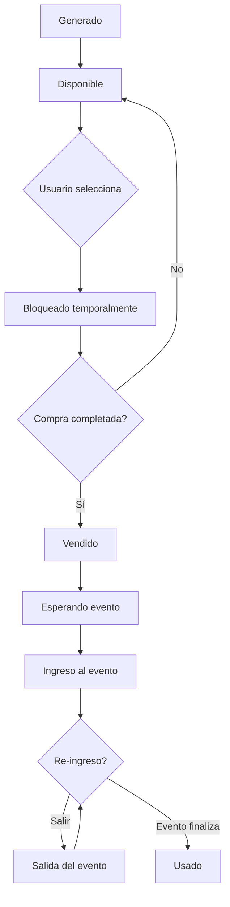

## Descripción General

El módulo de **Tickets** gestiona todo el ciclo de vida de los tickets, desde su generación masiva hasta el control de acceso en el evento. Incluye funcionalidades de bloqueo temporal, venta y validación de entrada/salida.

<Info>
  Los tickets se almacenan tanto en Firestore como en PostgreSQL para optimizar las consultas y mantener sincronización en tiempo real.
</Info>

## Estructura de Datos del Ticket

```javascript
{
  ticket_id: string,        // Formato: "{event_id}-{unique_id}"
  event_id: string,
  event_name: string,
  date_start: Timestamp,
  date_end: Timestamp,
  seat_id: string,          // Formato: "{zone_id}-{seat_number}"
  seat_row: string,         // "por asignar" inicialmente
  zone: string,
  color: string,            // Color de la zona
  status: boolean,          // true = disponible, false = vendido
  
  // Información del comprador (después de la venta)
  customer_email: string,
  customer_id: string,
  customer_name: string,
  customer_phone: string,
  customer_address: string,
  customer_country: {
    code: string,           // "ve", "us", etc.
    name: string,
    key: number
  },
  customer_id_type: string, // "V", "E", "J", etc.
  
  // Control de acceso
  access_status: boolean,   // true si ya ingresó al evento
  access_entry: boolean,    // true si está dentro del evento
  
  // Fechas
  date: {
    created: Timestamp,
    updated: Timestamp
  },
  
  // Historial de cambios
  ledger: [
    {
      date: Timestamp,
      action: string,       // "generated", "sold", "accessed", "came-out"
      metadata: string      // JSON stringificado
    }
  ]
}
```

## Generación de Tickets

### Proceso de Generación Masiva

Los tickets se generan automáticamente basándose en la configuración de zonas del evento:

```javascript tickets_generate.js:28
exports.tickets_generate = functions.https.onRequest(async (req, res) => {
  let doc = req.body.data.idevent;
  
  // Obtener configuración de zonas
  await db.collection("events").doc(doc)
    .collection("setup").doc("zones")
    .get()
    .then(async (snapshot) => {
      const datos = snapshot.data();
      
      // Generar tickets para cada zona
      await datos.zone.forEach(async (zone, index) => {
        for (let i = 1; i <= zone.seats; i++) {
          let idticket = db.collection("events").doc()._path.segments[1];
          
          let finalTicketsData = {
            date: {
              created: Timestamp.now(),
              updated: ''
            },
            event_id: doc,
            seat_id: zone.id + "-" + i,
            status: true,
            ticket_id: doc + "-" + idticket,
            zone: zone.name,
            color: zone.color,
            seat_row: "por asignar",
            ledger: [{
              date: Timestamp.now(),
              action: "generated",
              metadata: ""
            }]
          };
          
          // Guardar en Firestore
          batch.set(
            db.collection("events").doc(doc)
              .collection("tickets").doc(idticket),
            finalTicketsData
          );
          
          tickects_gen++;
        }
      });
      
      // Commit en batch y guardar en PostgreSQL
      await batch.commit();
      await dbpostgres.sqltmt("insert", "tickets", campos, null, null, null, null, valores);
    });
});
```

<Steps>
  <Step title="Leer Configuración">
    Se obtiene la configuración de zonas del evento desde `events/{id}/setup/zones`
  </Step>
  
  <Step title="Generar por Zona">
    Para cada zona, se generan N tickets según el número de asientos configurado
  </Step>
  
  <Step title="Asignar IDs">
    Cada ticket recibe un ID único en formato `{event_id}-{ticket_id}`
  </Step>
  
  <Step title="Batch Write">
    Se usa batch writing para optimizar escrituras en Firestore
  </Step>
  
  <Step title="Sincronizar PostgreSQL">
    Los tickets se guardan también en PostgreSQL para consultas rápidas
  </Step>
</Steps>

## Sistema de Bloqueo Temporal

### Bloquear Tickets (Lock)

Cuando un usuario selecciona tickets, estos se bloquean temporalmente:

```javascript tickets_generate.js:191
exports.tickets_lock = functions.https.onRequest(async (req, res) => {
  let ticketd_reserved = req.body.data.ticketd_reserved;
  let reserved_time = req.body.data.reserved_time; // segundos
  
  // Verificar disponibilidad
  const rows_tickets = await dbpostgres.sqltmt(
    "select", "tickets", 
    "status, ticket_id, ledger",
    " ticket_id in(" + intickets + ")"
  );
  
  let nodisponible = [];
  rows_tickets.forEach(item => {
    if (!item.status) {
      nodisponible.push(item.ticket_id);
    }
  });
  
  if (nodisponible.length > 0) {
    res.send({ 
      message: "Tickets no disponibles", 
      status: 400, 
      data: { valido: false, nodisponible: nodisponible } 
    });
  } else {
    // Bloquear tickets
    ticketd_reserved.forEach(async item => {
      let locked_up = moment(Timestamp.now().toDate())
        .add(reserved_time, 'seconds')
        .format();
      
      valores += "('" + item + "', '" + locked_up + "', '" + date_created + "')";
    });
    
    await dbpostgres.sqltmt(
      "insert", "tickets_blocked",
      "ticket_id, locked_up, date_created",
      null, null, null, null, valores
    );
  }
});
```

### Desbloquear Tickets (Unlock)

```javascript tickets_generate.js:248
exports.tickets_unlock = functions.https.onRequest(async (req, res) => {
  let date_comparar = moment(Timestamp.now().toDate()).format();
  
  // Eliminar bloqueos expirados
  await dbpostgres.sqltmt(
    "delete", "tickets_blocked", 
    null, 
    " locked_up <= '" + date_comparar + "'"
  );
});
```

<Note>
  El sistema ejecuta periódicamente `tickets_unlock` para liberar tickets cuyo tiempo de reserva expiró.
</Note>

## Consultas de Tickets

### Listar Tickets de un Evento

```javascript tickets_generate.js:115
exports.tickets_list_event = functions.https.onRequest(async (req, res) => {
  const listadoTicketss = await dbpostgres.sqltmt(
    "select", "tickets", "*",
    "event_id = '" + req.body.data.event_id + "'"
  );
});
```

### Obtener Ticket Individual

```javascript tickets_generate.js:131
exports.tickets_individual = functions.https.onRequest(async (req, res) => {
  const listadoTicketss = await dbpostgres.sqltmt(
    "select", "tickets", "*",
    "ticket_id = '" + req.body.data.ticket_id + "'"
  );
});
```

### Listar para Venta (con estado de bloqueo)

```javascript tickets_generate.js:259
exports.tickets_list_event_sales = functions.https.onRequest(async (req, res) => {
  let campos = `
    id, color, event_description, event_id, seat_id,
    CASE 
      WHEN status_d THEN false 
      WHEN status THEN true 
      ELSE false
    END status,
    t.status_offline, status status_real, t.ticket_id, 
    zone, event_name, seat_row, ledger
  `;
  
  let tablas = "tickets t LEFT JOIN tickets_blocked tb ON t.id = tb.ticket_id";
  
  const listadoTicketss = await dbpostgres.sqltmt(
    "select", tablas, campos,
    "event_id = '" + req.body.data.event_id + "'"
  );
});
```

<Info>
  Esta consulta usa un LEFT JOIN para mostrar tickets bloqueados como no disponibles temporalmente.
</Info>

## Actualización de Tickets

### Actualizar Estado Individual

```javascript tickets_generate.js:147
exports.tickets_update_individual = functions.https.onRequest(async (req, res) => {
  let id = req.body.data.id;
  let status = req.body.data.status;
  
  const ticket = await dbpostgres.sqltmt(
    "select", "tickets",
    "access_status, access_entry, status, ledger",
    "ticket_id = '" + id + "'"
  );
  
  // Actualizar ledger
  let responses = ticket[0].ledger;
  responses.push({
    date: Timestamp.now(),
    action: 'updated',
    metadata: "{}"
  });
  
  // Actualizar Firestore
  let arr_ids = id.split('-');
  await db.collection('events').doc(arr_ids[0])
    .collection('tickets').doc(arr_ids[1])
    .update({
      "status": status,
      "date.updated": Timestamp.now(),
      "ledger": responses
    });
  
  // Actualizar PostgreSQL
  await dbpostgres.sqltmt(
    "update", "tickets",
    " status = " + status + ", ledger = '" + responses_post + "' ::json",
    " ticket_id = '" + id + "'"
  );
});
```

## Control de Acceso

### Ingreso al Evento

```javascript tickets_generate.js:309
exports.tickets_access_control_in = functions.https.onRequest(async (req, res) => {
  let ticket_id = req.body.data.ticket_id;
  
  const ticket = await dbpostgres.sqltmt(
    "select", "tickets",
    "access_status, access_entry, status, ledger",
    "ticket_id = '" + ticket_id + "' and status = false"
  );
  
  if (ticket[0].access_status && ticket[0].access_entry) {
    res.send({ 
      message: "Ticket ya Utilizado no puede volver Ingresar", 
      status: 400 
    });
  } else if (ticket[0].access_status && !ticket[0].access_entry) {
    // Re-ingreso
    await dbpostgres.sqltmt(
      "update", "tickets",
      " access_entry = true",
      " ticket_id = '" + ticket_id + "'"
    );
    res.send({ message: "Ticket ReIngreso", status: 200 });
  } else {
    // Primer ingreso
    ticket[0].ledger.push({
      date: Timestamp.now(),
      action: 'accessed',
      metadata: "{}"
    });
    
    await dbpostgres.sqltmt(
      "update", "tickets",
      " access_status = true, access_entry = true, ledger = '" + responses_post + "' ::json",
      " ticket_id = '" + ticket_id + "'"
    );
    res.send({ message: "Ticket Ingresando", status: 200 });
  }
});
```

### Salida del Evento

```javascript tickets_generate.js:368
exports.tickets_access_control_out = functions.https.onRequest(async (req, res) => {
  let ticket_id = req.body.data.ticket_id;
  
  const ticket = await dbpostgres.sqltmt(
    "select", "tickets",
    "access_status, access_entry, status, ledger",
    "ticket_id = '" + ticket_id + "' and status = false"
  );
  
  if (!ticket[0].access_status && !ticket[0].access_entry) {
    res.send({ 
      message: "Ticket no Ingreso no puede salir", 
      status: 400 
    });
  } else if (ticket[0].access_status && ticket[0].access_entry) {
    // Registrar salida
    ticket[0].ledger.push({
      date: Timestamp.now(),
      action: 'came-out',
      metadata: "{}"
    });
    
    await dbpostgres.sqltmt(
      "update", "tickets",
      " access_entry = false, ledger = '" + responses_post + "' ::json",
      " ticket_id = '" + ticket_id + "'"
    );
    res.send({ message: "Ticket Salida", status: 200 });
  }
});
```

<Warning>
  El control de acceso verifica que el ticket esté vendido (`status = false`) antes de permitir entrada/salida.
</Warning>

## Sincronización en Frío (Offline)

### Control de Acceso sin Conexión

Para eventos con lectores de tickets offline:

```javascript tickets_generate.js:421
exports.tickets_access_control_cold = functions.https.onRequest(async (req, res) => {
  let tickets_cold = req.body.data.tickets_cold;
  // Formato: [{ticket_id: "...", date: Timestamp, tipo: "in|out"}]
  
  tickets_cold.forEach(async (cold, index) => {
    const ticket = await dbpostgres.sqltmt(
      "select", "tickets",
      "access_status, access_entry, status, ledger",
      "ticket_id = '" + cold.ticket_id + "' and status = false"
    );
    
    // Procesar cada acción (in/out)
    tickets_cold.find((value, index) => {
      if (value.ticket_id == cold.ticket_id) {
        if (value.tipo == "in") {
          action = "accessed";
          access_entry = true;
        } else {
          action = "came-out";
          access_entry = false;
        }
        
        responses.push({
          date: Timestamp.now(),
          action: action,
          metadata: "{}"
        });
      }
    });
    
    // Actualizar en batch
    batch.update(
      db.collection('events').doc(arr_ids[0])
        .collection('tickets').doc(arr_ids[1]),
      {
        "access_status": true,
        "access_entry": access_entry,
        "date.updated": Timestamp.now(),
        "ledger": responses
      }
    );
  });
  
  await batch.commit();
  await dbpostgres.sqltmt(
    "update", "tickets", campos,
    " ticket_id = tmp.ticket"
  );
});
```

<Note>
  Esta función permite sincronizar múltiples lecturas offline de tickets una vez restaurada la conexión.
</Note>

## Flujo del Ciclo de Vida del Ticket



## Estados del Ledger

El campo `ledger` registra todas las acciones sobre un ticket:

<CardGroup cols={2}>
  <Card title="generated" icon="plus">
    Ticket creado en el sistema
  </Card>
  
  <Card title="sold" icon="dollar-sign">
    Ticket vendido a un cliente
  </Card>
  
  <Card title="accessed" icon="door-open">
    Cliente ingresó al evento
  </Card>
  
  <Card title="came-out" icon="door-closed">
    Cliente salió del evento
  </Card>
  
  <Card title="updated" icon="pen">
    Información del ticket actualizada
  </Card>
</CardGroup>

## API Relacionadas

<CardGroup cols={2}>
  <Card title="Generar Tickets" icon="sparkles" href="/api/events/tickets-generate">
    Genera tickets masivamente para un evento
  </Card>
  
  <Card title="Bloquear Tickets" icon="lock" href="/api/events/tickets-lock">
    Bloquea tickets temporalmente durante compra
  </Card>
  
  <Card title="Desbloquear Tickets" icon="unlock" href="/api/events/tickets-lock">
    Libera bloqueos expirados
  </Card>
  
  <Card title="Control de Acceso" icon="qrcode" href="/api/events/access-control">
    Valida entrada/salida de tickets
  </Card>
</CardGroup>

## Próximos Pasos

<CardGroup cols={2}>
  <Card title="Módulo de Órdenes" icon="cart-shopping" href="/modules/orders">
    Aprende cómo se procesan las órdenes de compra
  </Card>
  
  <Card title="Módulo de Transacciones" icon="money-bill-transfer" href="/modules/transactions">
    Descubre el procesamiento de pagos
  </Card>
</CardGroup>