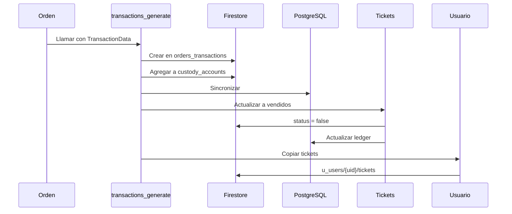

## Descripción General

El módulo de **Transacciones** gestiona el procesamiento de pagos, actualización de tickets vendidos y registro en cuentas de custodia. Se ejecuta automáticamente después de crear una orden y es responsable de marcar los tickets como vendidos.

<Info>
  Las transacciones se crean a partir de las órdenes y se registran en múltiples colecciones para trazabilidad completa.
</Info>

## Estructura de Datos de la Transacción

```javascript
{
  // Identificación
  order_transaction_id: string,
  order_id: string,
  
  // Montos
  amount: number,              // Monto en moneda base
  amount_currency: string,     // "USD", "VEF", "EUR"
  amount_exchange: number,     // Monto en moneda de pago
  amount_exchange_rate: number,// Tasa de cambio aplicada
  amount_type: string,         // "payment", "refund"
  
  // Información del evento
  event_id: string,
  event_name: string,
  
  // Información de la oficina
  office_id: string,
  office_name: string,
  
  // Cliente (organizador)
  client_id: string,
  client_name: string,
  
  // Método de pago
  payment_id: string,
  payment_name: string,        // "Zelle", "Pago Móvil", "Transferencia"
  payment_data: {
    // Para transferencias bancarias
    account_number?: string,
    bank?: string,
    reference_number?: string,
    
    // Para pagos móviles
    phone?: string,
    
    // Para pagos digitales
    email?: string,
    name?: string
  },
  
  // Cuenta de custodia (donde se recibe el pago)
  custody_account: {
    id: string,
    name: string,
    account_number: string
  },
  
  // Estado
  status: boolean,
  
  // Fechas
  date: {
    created: Timestamp,
    updated: Timestamp
  }
}
```

## Generación de Transacciones

### Proceso Principal

Las transacciones se generan automáticamente desde el trigger `order_process`:

```javascript transactions.js:31
exports.transactions_generate = functions.https.onRequest(async (req, res) => {
  let collection = "orders_transactions";
  let idorder_id = req.body.data.idorder_id;
  let TransactionData = req.body.data.TransactionData;
  let infotickets = req.body.data.infotickets;
  let event_id = req.body.data.event_id;
  let users_uid = req.body.data.users_uid;
  let customer_email = req.body.data.customer_email;
  
  let valores_tr = "";
  let campos_tr = "id,amount,client_id,client_name,custody_account_id," +
    "custody_account_name,date_created,date_updated,event_id,event_name," +
    "office_id,office_name,order_id,payment_data,payment_id,payment_name," +
    "status,amount_currency,amount_exchange,amount_exchange_rate";
  
  // 1. Crear transacciones en Firestore y custody_accounts
  await TransactionData.forEach(async (transaction, index) => {
    let idtransaction = db.collection(collection).doc()._path.segments[1];
    
    transaction.date.created = Timestamp.now();
    transaction.date.updated = Timestamp.now();
    
    // Guardar en orders_transactions
    await admin.firestore()
      .collection(collection).doc(idtransaction)
      .set(transaction);
    
    // Agregar a la cuenta de custodia
    transaction.amount_type = "payment";
    transaction.order_transaction_id = idtransaction;
    await admin.firestore()
      .collection("custody_accounts").doc(transaction.custody_account.id)
      .collection("transactions")
      .add(transaction);
    
    // Preparar datos para PostgreSQL
    let payment_datos = "{}";
    if (transaction.payment_data.email) {
      payment_datos = '{"email": "' + transaction.payment_data.email + 
        '", "name": "' + transaction.payment_data.name + 
        '", "phone": "' + transaction.payment_data.phone + '"}';
    }
    if (transaction.payment_data.account_number) {
      payment_datos = '{"account_number": "' + transaction.payment_data.account_number + 
        '", "bank": "' + transaction.payment_data.bank + 
        '", "reference_number": "' + transaction.payment_data.reference_number + '"}';
    }
    if (transaction.payment_data.bank) {
      payment_datos = '{"bank": "' + transaction.payment_data.bank + 
        '", "phone": "' + transaction.payment_data.phone + 
        '", "reference_number": "' + transaction.payment_data.reference_number + '"}';
    }
    
    valores_tr += "('" + idtransaction + "', " + transaction.amount + 
      ", '" + transaction.client_id + "', ...";
  });
  
  // 2. Sincronizar con PostgreSQL
  await dbpostgres.sqltmt(
    "insert", "orders_transactions", campos_tr,
    null, null, null, null, valores_tr
  );
});
```

<Steps>
  <Step title="Crear en orders_transactions">
    Se guarda cada transacción en la colección principal
  </Step>
  
  <Step title="Registrar en custody_accounts">
    Se agrega a la subcolección de transacciones de la cuenta de custodia
  </Step>
  
  <Step title="Sincronizar PostgreSQL">
    Se replica en la base de datos relacional
  </Step>
  
  <Step title="Actualizar Tickets">
    Se marcan los tickets como vendidos
  </Step>
  
  <Step title="Agregar a Usuario">
    Se copian los tickets a la subcolección del usuario
  </Step>
</Steps>

## Actualización de Tickets a "Vendidos"

Después de crear las transacciones, el sistema marca los tickets como vendidos:

```javascript transactions.js:82
// Obtener ledger actual de los tickets
const rows_tickets_ledger = await dbpostgres.sqltmt(
  "select", "tickets",
  "ledger, ticket_id",
  " ticket_id in(" + intickets + ")"
);

var batch = db.batch();
let date_update = moment(Timestamp.now().toDate()).format();

await infotickets.forEach(async (ticket) => {
  let responses = [{}];
  let responses_post = '[';
  
  // Copiar ledger existente
  rows_tickets_ledger.forEach(async (ledger) => {
    if (ledger.ticket_id == ticket) {
      ledger.ledger.forEach((valor_ledger, index) => {
        let resp = {
          date: valor_ledger.date,
          action: valor_ledger.action,
          metadata: valor_ledger.metadata
        };
        responses[index] = resp;
        responses_post += '{"date": "' + valor_ledger.date + 
          '", "action": "' + valor_ledger.action + 
          '", "metadata":"' + valor_ledger.metadata + '"}';
      });
      
      // Agregar acción "sold"
      responses.push({
        date: Timestamp.now(),
        action: 'sold',
        metadata: "{}"
      });
      responses_post += ', {"date": "' + moment(Timestamp.now().toDate()).format() + 
        '", "action": "sold", "metadata":"{}"}';
    }
  });
  
  // Actualizar en Firestore
  let arr_ids = ticket.split('-');
  batch.update(
    db.collection('events').doc(arr_ids[0])
      .collection('tickets').doc(arr_ids[1]),
    {
      "status": false,  // false = vendido
      "date.updated": Timestamp.now(),
      "ledger": responses
    }
  );
});

await batch.commit();

// Actualizar PostgreSQL
await dbpostgres.sqltmt(
  "update", "tickets",
  "status=tmp.status, date_updated=tmp.date_updated, ledger=tmp.ledger " +
  "from (values " + valores + ") as tmp (status,date_updated,ticket,ledger)",
  " ticket_id = tmp.ticket"
);
```

<Warning>
  Es crítico que el campo `status` del ticket se actualice a `false` para marcarlo como vendido y evitar ventas duplicadas.
</Warning>

## Agregar Tickets al Usuario

Después de marcar como vendidos, los tickets se copian a la colección del usuario comprador:

```javascript transactions.js:133
await db.collection("u_users")
  .where("email", "==", customer_email)
  .get()
  .then(async (u_users) => {
    u_users.forEach(async doc_users => {
      users_uid = doc_users.id;
      
      // Obtener tickets del evento
      await db.collection("events").doc(event_id)
        .collection("tickets")
        .where("ticket_id", "in", infotickets)
        .get()
        .then(async (snapshot) => {
          if (snapshot._size > 0) {
            snapshot.forEach(async (doc) => {
              let data = doc.data();
              
              // Copiar ticket a la colección del usuario
              await admin.firestore()
                .collection("u_users").doc(users_uid)
                .collection("tickets").doc(data.ticket_id)
                .set(data);
            });
          }
        });
    });
  });
```

<Info>
  Cada usuario tiene una subcolección `tickets` con copias de sus tickets para acceso rápido sin consultar todos los eventos.
</Info>

## Registro en Cuentas de Custodia

Las transacciones se registran en las cuentas de custodia donde se reciben los pagos:

```javascript transactions.js:62
transaction.amount_type = "payment";
transaction.order_transaction_id = idtransaction;

await admin.firestore()
  .collection("custody_accounts").doc(transaction.custody_account.id)
  .collection("transactions")
  .add(transaction);
```

### Estructura de custody_accounts

```
custody_accounts/{account_id}
├── name: string
├── account_number: string
├── bank: string
├── currency: string
└── transactions (subcolección)
    └── {transaction_id}
        ├── order_id
        ├── amount
        ├── amount_type: "payment" | "refund"
        └── date
```

<Note>
  Las cuentas de custodia permiten rastrear todos los pagos recibidos en cada cuenta bancaria o método de pago.
</Note>

## Tipos de Datos de Pago

El sistema soporta múltiples métodos de pago con diferentes estructuras de datos:

<Accordion title="Transferencia Bancaria">
```json
{
  "payment_data": {
    "account_number": "01020123456789012345",
    "bank": "Banco de Venezuela",
    "reference_number": "123456789"
  }
}
```
</Accordion>

<Accordion title="Pago Móvil">
```json
{
  "payment_data": {
    "bank": "Banesco",
    "phone": "04121234567",
    "reference_number": "987654321"
  }
}
```
</Accordion>

<Accordion title="Zelle / PayPal">
```json
{
  "payment_data": {
    "email": "usuario@example.com",
    "name": "Juan Pérez",
    "phone": "+1234567890"
  }
}
```
</Accordion>

<Accordion title="Efectivo">
```json
{
  "payment_data": {
    "received_by": "Taquilla 01",
    "receipt_number": "REC-001"
  }
}
```
</Accordion>

## Manejo de Múltiples Monedas

El sistema soporta transacciones en múltiples monedas:

```javascript
{
  amount: 100,                    // Monto base en USD
  amount_currency: "VEF",         // Moneda de pago
  amount_exchange: 3650,          // Monto en moneda de pago
  amount_exchange_rate: 36.50     // Tasa de cambio USD -> VEF
}
```

<CardGroup cols={2}>
  <Card title="Moneda Base" icon="dollar-sign">
    USD se usa como moneda base del sistema
  </Card>
  
  <Card title="Tasa de Cambio" icon="arrows-rotate">
    Se almacena la tasa aplicada en cada transacción
  </Card>
</CardGroup>

## Flujo de Transacciones



## Función Legacy (Deprecated)

### transactions_generate_old

Existe una implementación antigua que se mantiene por compatibilidad:

```javascript transactions.js:173
exports.transactions_generate_old = functions.https.onRequest(async (req, res) => {
  let collection = "transactions";
  let idtaquilla = req.body.data.idtaquilla;
  let TransactionData = req.body.data.TransactionData;
  
  // Escritura en batch en múltiples colecciones
  var writeTransaction = db.collection(collection).doc(idtransaction);
  batch.set(writeTransaction, TransactionData);
  
  var writeEventTransaction = db.collection("events")
    .doc(TransactionData.event_id)
    .collection(collection).doc(idtransaction);
  batch.set(writeEventTransaction, TransactionData);
  
  var writeOfficeTransaction = db.collection("offices").doc(idtaquilla)
    .collection(collection).doc(idtransaction);
  batch.set(writeOfficeTransaction, TransactionData);
  
  // Actualizar contadores
  var writeTransactionCounter = db.collection("events")
    .doc(TransactionData.event_id);
  batch.update(writeTransactionCounter, {
    "counter_transactions": FieldValue.increment(1),
    "counter_tickets": FieldValue.increment(TransactionData.ticket_total)
  });
  
  await batch.commit();
});
```

<Warning>
  La función `transactions_generate_old` está deprecada. Usa `transactions_generate` para nuevas implementaciones.
</Warning>

## Consultas de Transacciones

### Por Orden

```javascript
const transactions = await db.collection("orders_transactions")
  .where("order_id", "==", order_id)
  .get();
```

### Por Evento

```javascript
const transactions = await db.collection("orders_transactions")
  .where("event_id", "==", event_id)
  .get();
```

### Por Cuenta de Custodia

```javascript
const transactions = await db.collection("custody_accounts")
  .doc(account_id)
  .collection("transactions")
  .orderBy("date.created", "desc")
  .get();
```

### Por Usuario (desde PostgreSQL)

```javascript
const transactions = await dbpostgres.sqltmt(
  "select",
  "orders_transactions ot JOIN orders o ON ot.order_id = o.id",
  "ot.*, o.client_name",
  "o.customer_email = 'usuario@example.com'",
  null, null, null, null,
  "ot.date_created DESC"
);
```

## Colecciones Involucradas

<CardGroup cols={2}>
  <Card title="orders_transactions" icon="receipt">
    Colección principal de transacciones
  </Card>
  
  <Card title="custody_accounts/{id}/transactions" icon="building-columns">
    Transacciones por cuenta de custodia
  </Card>
  
  <Card title="events/{id}/tickets" icon="ticket">
    Tickets actualizados a vendidos
  </Card>
  
  <Card title="u_users/{uid}/tickets" icon="user">
    Copia de tickets del usuario
  </Card>
</CardGroup>

## Manejo de Errores

<Warning>
  Si falla la generación de transacciones, la orden quedará en estado inconsistente. Se debe implementar manejo de rollback.
</Warning>

### Validaciones Importantes

<Steps>
  <Step title="Verificar Orden Existe">
    Validar que `order_id` existe antes de crear transacciones
  </Step>
  
  <Step title="Validar Tickets Disponibles">
    Confirmar que todos los tickets aún están disponibles
  </Step>
  
  <Step title="Verificar Cuenta de Custodia">
    Validar que la cuenta de custodia existe y está activa
  </Step>
  
  <Step title="Confirmar Monto Correcto">
    Verificar que la suma de transacciones = monto de la orden
  </Step>
</Steps>

## Reportes y Análisis

Las transacciones en PostgreSQL permiten consultas complejas:

```sql
-- Total de transacciones por método de pago
SELECT 
  payment_name,
  amount_currency,
  COUNT(*) as total_transactions,
  SUM(amount_exchange) as total_amount
FROM orders_transactions
WHERE event_id = 'event_123'
GROUP BY payment_name, amount_currency;

-- Transacciones por cuenta de custodia
SELECT 
  custody_account_name,
  DATE(date_created) as fecha,
  COUNT(*) as num_transacciones,
  SUM(amount) as total_usd
FROM orders_transactions
GROUP BY custody_account_name, DATE(date_created)
ORDER BY fecha DESC;
```

## API Relacionadas

<CardGroup cols={2}>
  <Card title="Generar Transacciones" icon="plus" href="/api/orders/create-order">
    Crea transacciones desde una orden
  </Card>
  
  <Card title="Validar Transacciones" icon="search" href="/api/transactions/validate">
    Valida transacciones de una orden
  </Card>
  
  <Card title="Consultar por Cuenta" icon="building-columns" href="/modules/transactions">
    Lista transacciones de una cuenta de custodia
  </Card>
</CardGroup>

## Próximos Pasos

<CardGroup cols={2}>
  <Card title="Módulo de Órdenes" icon="cart-shopping" href="/modules/orders">
    Entiende el flujo completo de órdenes
  </Card>
  
  <Card title="Módulo de Tickets" icon="ticket" href="/modules/tickets">
    Aprende sobre el estado de tickets vendidos
  </Card>
</CardGroup>