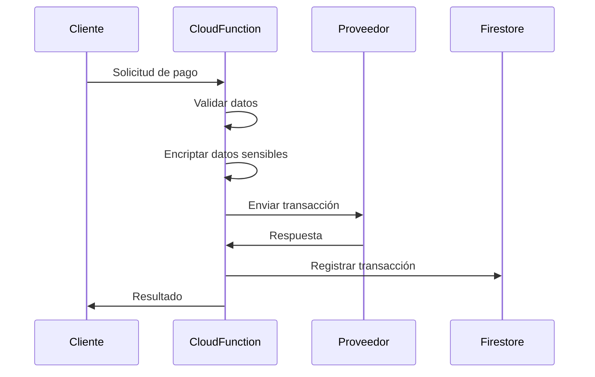

## Descripción General

TMT soporta múltiples métodos de pago a través de diferentes proveedores bancarios venezolanos e internacionales. El sistema está diseñado para procesar pagos de manera segura y eficiente.

## Proveedores Disponibles

<CardGroup cols={3}>
  <Card title="Mercantil" icon="credit-card" href="/payments/mercantil">
    Tarjetas de débito (TDD), crédito (TDC) y pagos móviles (C2P)
  </Card>
  <Card title="Banco de Venezuela" icon="building-columns" href="/payments/bdv">
    Conciliación bancaria y pagos móviles
  </Card>
  <Card title="Stripe" icon="stripe" href="/payments/stripe">
    Procesamiento de pagos internacionales
  </Card>
</CardGroup>

## Arquitectura de Pagos

Todos los endpoints de pago están implementados como Firebase Cloud Functions con las siguientes características:

<Steps>
  <Step title="Autenticación">
    Cada proveedor requiere credenciales específicas configuradas en variables de entorno
  </Step>
  <Step title="Encriptación">
    Datos sensibles como CVV y códigos 2FA son encriptados con AES-256
  </Step>
  <Step title="CORS">
    Todas las funciones tienen CORS habilitado con origen wildcard
  </Step>
  <Step title="Logging">
    Todas las transacciones son registradas para auditoría
  </Step>
</Steps>

## Flujo General de Pago



## Configuración de Encriptación

El sistema utiliza el módulo `encryption.js` para proteger datos sensibles:

```javascript
const encryption = require("../../../config/encryption");
const cifr = config.cifr; // Clave de encriptación

// Encriptar datos
const cvv_encr = encryption.encryptAES256(cvv, cifr);

// Desencriptar datos
const valorarchivo = encryption.decryptAES256(decodedCifContent, cifr_ted);
```

<Warning>
  Las claves de encriptación deben mantenerse seguras y no deben ser hardcodeadas en el código
</Warning>

## Manejo de Errores

Todos los endpoints siguen un patrón consistente de respuesta:

### Respuesta Exitosa
```json
{
  "message": "Procesado",
  "status": 200,
  "data": {
    // Datos específicos del proveedor
  }
}
```

### Respuesta de Error
```json
{
  "message": "Error en el Proceso",
  "status": 400,
  "error": "Descripción del error"
}
```

## Conciliación Bancaria

El sistema incluye funcionalidades de conciliación automática con PostgreSQL:

- **conc_conciliado_b**: Registros bancarios de entrada y salida
- **conc_conciliado_c**: Registros de conciliación de pagos

<Info>
  La conciliación se ejecuta automáticamente para validar transacciones contra los estados de cuenta bancarios
</Info>

## Variables de Configuración

Cada proveedor requiere las siguientes configuraciones en `config.js`:

<CodeGroup>
```javascript Mercantil
const merchantId = config.merchantId
const client_id = config.clientidibm
const cifr = config.cifr
const cifr_ted = config.cifr_ted
const merchantId_ted = config.merchantId_ted
```

```javascript BDV
const cuentabdv = config.cuentabdv
const apibdv = config.apibdv
```

```javascript Stripe
const STRIPE_SECRET_KEY = process.env.STRIPE_SECRET_KEY
const STRIPE_WEBHOOK_SECRET = process.env.STRIPE_WEBHOOK_SECRET
```
</CodeGroup>

## Próximos Pasos

<CardGroup cols={3}>
  <Card title="Mercantil" icon="arrow-right" href="/payments/mercantil">
    Implementar pagos con Mercantil
  </Card>
  <Card title="BDV" icon="arrow-right" href="/payments/bdv">
    Configurar Banco de Venezuela
  </Card>
  <Card title="Stripe" icon="arrow-right" href="/payments/stripe">
    Integrar pagos internacionales
  </Card>
</CardGroup>
