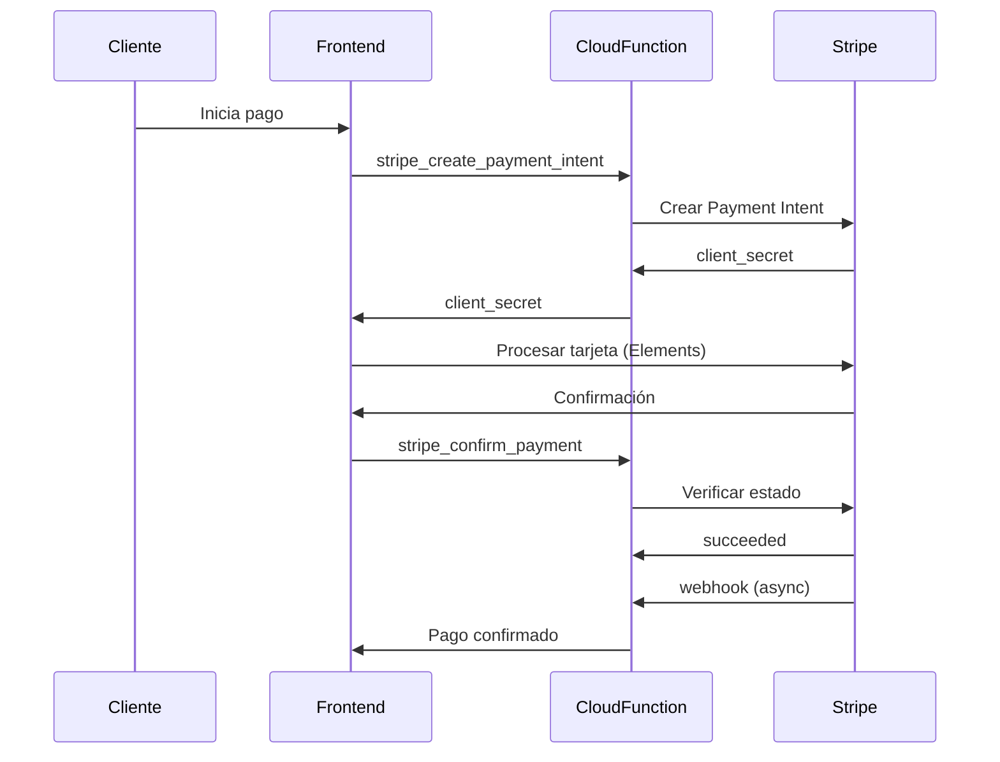

## Descripción

Stripe es el proveedor de pagos internacionales de TMT, permitiendo procesar pagos con tarjetas de crédito de clientes de todo el mundo.

<Info>
  Ubicación del código: `functions/banking/stripe/api_stripe.js`
</Info>

## Características

- **Payment Intents**: Sistema de pagos en dos pasos (crear + confirmar)
- **Múltiples Monedas**: Soporte para USD y otras monedas
- **Webhooks**: Notificaciones automáticas de eventos
- **Metadata**: Almacenamiento de información personalizada
- **SCA Compliant**: Compatible con Strong Customer Authentication

## Configuración

### Variables de Entorno

```javascript
const STRIPE_SECRET_KEY = process.env.STRIPE_SECRET_KEY || '-'
const STRIPE_WEBHOOK_SECRET = process.env.STRIPE_WEBHOOK_SECRET || 'whsec_...'
```

<Warning>
  **IMPORTANTE**: Las claves de Stripe deben configurarse en variables de entorno y nunca hardcodearse en producción
</Warning>

### Inicialización

```javascript
const stripe = require('stripe')(STRIPE_SECRET_KEY);
```

## Flujo de Pago

<Steps>
  <Step title="Crear Payment Intent">
    El backend crea un intent de pago con el monto y obtiene un client_secret
  </Step>
  <Step title="Procesar en Frontend">
    El cliente ingresa los datos de su tarjeta y Stripe los procesa de forma segura
  </Step>
  <Step title="Confirmar Pago">
    Se confirma el estado del pago en el backend
  </Step>
  <Step title="Webhook">
    Stripe notifica el resultado final del pago
  </Step>
</Steps>



## Crear Payment Intent

### Endpoint: `stripe_create_payment_intent`

Crea un Payment Intent que será confirmado desde el frontend.

**Request:**

```javascript
const response = await fetch('YOUR_FUNCTION_URL/stripe_create_payment_intent', {
  method: 'POST',
  headers: {
    'Content-Type': 'application/json',
  },
  body: JSON.stringify({
    data: {
      amount: 25.00,
      currency: 'usd',
      description: 'Compra de 2 tickets para Concierto XYZ',
      metadata: {
        event_id: 'evt_123',
        user_id: 'user_456',
        order_id: 'order_789'
      }
    }
  })
});
```

### Parámetros

| Parámetro | Tipo | Requerido | Descripción |
|-----------|------|-----------|-------------|
| `amount` | number | Sí | Monto en dólares (será convertido a centavos) |
| `currency` | string | No | Moneda (default: 'usd') |
| `description` | string | No | Descripción del pago |
| `metadata` | object | No | Datos personalizados |

### Código de Implementación (api_stripe.js:23-76)

```javascript
exports.stripe_create_payment_intent = functions.https.onRequest(async (req, res) => {
    cors(req, res, async () => {
        try {
            const { amount, currency = 'usd', metadata = {}, description } = req.body.data;

            // Validar que el monto existe
            if (!amount || amount <= 0) {
                return res.send({
                    message: "Error en el Proceso",
                    status: 400,
                    error: 'El monto es requerido y debe ser mayor a 0'
                });
            }

            // Crear el Payment Intent
            const amountInCents = Math.round(Number(amount) * 100);

            console.log(`💰 Conversión de monto: ${amount} USD -> ${amountInCents} centavos`);

            const paymentIntent = await stripe.paymentIntents.create({
                amount: amountInCents,
                currency: currency.toLowerCase(),
                description: description || 'Compra de tickets',
                metadata: {
                    ...metadata,
                    platform: 'TMT',
                    timestamp: new Date().toISOString()
                },
                payment_method_types: ['card'],
            });

            console.log('Payment Intent creado:', paymentIntent.id);

            return res.send({
                message: "Procesado",
                status: 200,
                data: {
                    success: true,
                    client_secret: paymentIntent.client_secret,
                    payment_intent_id: paymentIntent.id
                }
            });

        } catch (error) {
            console.error('Error al crear Payment Intent:', error);
            return res.send({
                message: "Error en el Proceso",
                status: 500,
                error: error.message || 'Error al procesar la solicitud'
            });
        }
    });
});
```

### Response

```json
{
  "message": "Procesado",
  "status": 200,
  "data": {
    "success": true,
    "client_secret": "pi_3ABC123_secret_XYZ789",
    "payment_intent_id": "pi_3ABC123"
  }
}
```

<Note>
  El `client_secret` se usa en el frontend con Stripe Elements para procesar la tarjeta de forma segura
</Note>

### Conversión de Montos

```javascript
// El monto se envía en dólares
const amount = 25.00;

// Se convierte a centavos para Stripe
const amountInCents = Math.round(Number(amount) * 100);  // 2500
```

<Tip>
  Stripe siempre trabaja con las unidades más pequeñas de cada moneda (centavos para USD, céntimos para EUR, etc.)
</Tip>

## Integración Frontend

### Instalar Stripe.js

```bash
npm install @stripe/stripe-js
```

### Procesar Pago en Frontend

```javascript
import { loadStripe } from '@stripe/stripe-js';

// Inicializar Stripe con tu Publishable Key
const stripe = await loadStripe('pk_test_...');

// 1. Crear Payment Intent
const response = await fetch('YOUR_FUNCTION_URL/stripe_create_payment_intent', {
  method: 'POST',
  headers: { 'Content-Type': 'application/json' },
  body: JSON.stringify({
    data: {
      amount: 25.00,
      currency: 'usd',
      metadata: {
        event_id: 'evt_123',
        user_id: 'user_456'
      }
    }
  })
});

const { data } = await response.json();
const { client_secret } = data;

// 2. Confirmar pago con Stripe Elements
const { error, paymentIntent } = await stripe.confirmCardPayment(client_secret, {
  payment_method: {
    card: cardElement,  // Elemento de Stripe Elements
    billing_details: {
      name: 'John Doe',
      email: 'john@example.com'
    }
  }
});

if (error) {
  console.error('Error en pago:', error);
} else if (paymentIntent.status === 'succeeded') {
  console.log('¡Pago exitoso!', paymentIntent.id);
  
  // 3. Confirmar en backend
  await fetch('YOUR_FUNCTION_URL/stripe_confirm_payment', {
    method: 'POST',
    headers: { 'Content-Type': 'application/json' },
    body: JSON.stringify({
      data: {
        payment_intent_id: paymentIntent.id
      }
    })
  });
}
```

## Confirmar Pago

### Endpoint: `stripe_confirm_payment`

Verifica el estado final de un Payment Intent.

**Request:**

```javascript
const response = await fetch('YOUR_FUNCTION_URL/stripe_confirm_payment', {
  method: 'POST',
  headers: {
    'Content-Type': 'application/json',
  },
  body: JSON.stringify({
    data: {
      payment_intent_id: 'pi_3ABC123'
    }
  })
});
```

### Código de Implementación (api_stripe.js:83-143)

```javascript
exports.stripe_confirm_payment = functions.https.onRequest(async (req, res) => {
    cors(req, res, async () => {
        try {
            const { payment_intent_id } = req.body.data;

            if (!payment_intent_id) {
                return res.send({
                    message: "Error en el Proceso",
                    status: 400,
                    error: 'ID de Payment Intent es requerido'
                });
            }

            // Obtener el Payment Intent
            const paymentIntent = await stripe.paymentIntents.retrieve(payment_intent_id);

            console.log('Payment Intent recuperado:', paymentIntent.id, 'Status:', paymentIntent.status);

            // Verificar el estado del pago
            if (paymentIntent.status === 'succeeded') {
                return res.send({
                    message: "Procesado",
                    status: 200,
                    data: {
                        success: true,
                        payment_intent: {
                            id: paymentIntent.id,
                            status: paymentIntent.status,
                            amount: paymentIntent.amount / 100,  // Convertir de centavos a dólares
                            currency: paymentIntent.currency,
                            created: paymentIntent.created,
                            payment_method: paymentIntent.payment_method,
                            charges: paymentIntent.charges.data
                        }
                    }
                });
            } else {
                return res.send({
                    message: "Error en el Proceso",
                    status: 400,
                    error: `El pago no fue completado. Estado: ${paymentIntent.status}`,
                    data: {
                        payment_intent: {
                            id: paymentIntent.id,
                            status: paymentIntent.status
                        }
                    }
                });
            }

        } catch (error) {
            console.error('Error al confirmar pago:', error);
            return res.send({
                message: "Error en el Proceso",
                status: 500,
                error: error.message || 'Error al procesar la confirmación del pago'
            });
        }
    });
});
```

### Response Exitosa

```json
{
  "message": "Procesado",
  "status": 200,
  "data": {
    "success": true,
    "payment_intent": {
      "id": "pi_3ABC123",
      "status": "succeeded",
      "amount": 25.00,
      "currency": "usd",
      "created": 1647891234,
      "payment_method": "pm_123456",
      "charges": [
        {
          "id": "ch_123456",
          "amount": 2500,
          "paid": true
        }
      ]
    }
  }
}
```

### Estados de Payment Intent

| Estado | Descripción |
|--------|-------------|
| `requires_payment_method` | Esperando método de pago |
| `requires_confirmation` | Esperando confirmación |
| `requires_action` | Requiere autenticación 3D Secure |
| `processing` | Procesando pago |
| `succeeded` | Pago exitoso |
| `canceled` | Pago cancelado |

## Webhooks

### Endpoint: `stripe_webhook`

Recibe notificaciones automáticas de Stripe sobre eventos de pago.

<Steps>
  <Step title="Verificar Firma">
    Valida que el webhook viene de Stripe
  </Step>
  <Step title="Procesar Evento">
    Maneja diferentes tipos de eventos
  </Step>
  <Step title="Actualizar BD">
    Registra el resultado en Firestore
  </Step>
  <Step title="Responder a Stripe">
    Confirma recepción del webhook
  </Step>
</Steps>

### Código de Implementación (api_stripe.js:149-186)

```javascript
exports.stripe_webhook = functions.https.onRequest(async (req, res) => {
    const sig = req.headers['stripe-signature'];
    const webhookSecret = process.env.STRIPE_WEBHOOK_SECRET || 'whsec_...';

    let event;

    try {
        // Verificar firma del webhook
        event = stripe.webhooks.constructEvent(req.body, sig, webhookSecret);
    } catch (err) {
        console.error('Webhook signature verification failed:', err.message);
        return res.status(400).send(`Webhook Error: ${err.message}`);
    }

    // Manejar el evento
    switch (event.type) {
        case 'payment_intent.succeeded':
            const paymentIntent = event.data.object;
            console.log('PaymentIntent succeeded:', paymentIntent.id);

            // Aquí puedes actualizar tu base de datos, enviar emails, etc.
            // Por ejemplo:
            // await updateOrderStatus(paymentIntent.metadata.order_id, 'paid');

            break;

        case 'payment_intent.payment_failed':
            const failedPayment = event.data.object;
            console.log('PaymentIntent failed:', failedPayment.id);

            // Manejar pago fallido
            break;

        default:
            console.log(`Unhandled event type ${event.type}`);
    }

    res.json({ received: true });
});
```

### Configurar Webhook en Stripe

1. Ir a [Stripe Dashboard → Developers → Webhooks](https://dashboard.stripe.com/webhooks)
2. Click en "Add endpoint"
3. Ingresar URL: `https://YOUR_REGION-YOUR_PROJECT.cloudfunctions.net/stripe_webhook`
4. Seleccionar eventos:
   - `payment_intent.succeeded`
   - `payment_intent.payment_failed`
   - `payment_intent.canceled`
5. Copiar el **Signing secret** y guardarlo en variables de entorno

<Warning>
  **Seguridad del Webhook:**
  - Siempre verificar la firma del webhook
  - Usar HTTPS en producción
  - No confiar en datos sin verificación
</Warning>

### Eventos Comunes

```javascript
switch (event.type) {
  case 'payment_intent.succeeded':
    // Pago exitoso - actualizar orden, enviar email de confirmación
    await updateOrderStatus(event.data.object.metadata.order_id, 'paid');
    await sendConfirmationEmail(event.data.object.metadata.user_id);
    break;

  case 'payment_intent.payment_failed':
    // Pago fallido - notificar al usuario
    await notifyPaymentFailure(event.data.object.metadata.user_id);
    break;

  case 'payment_intent.canceled':
    // Pago cancelado - liberar inventario
    await releaseTickets(event.data.object.metadata.order_id);
    break;

  case 'charge.refunded':
    // Reembolso procesado
    await processRefund(event.data.object);
    break;

  case 'charge.dispute.created':
    // Disputa creada - alertar soporte
    await alertSupport(event.data.object);
    break;
}
```

## Obtener Payment Intent

### Endpoint: `stripe_get_payment_intent`

Obtiene información detallada de un Payment Intent.

**Request:**

```javascript
const response = await fetch('YOUR_FUNCTION_URL/stripe_get_payment_intent', {
  method: 'POST',
  headers: {
    'Content-Type': 'application/json',
  },
  body: JSON.stringify({
    data: {
      payment_intent_id: 'pi_3ABC123'
    }
  })
});
```

### Código de Implementación (api_stripe.js:191-231)

```javascript
exports.stripe_get_payment_intent = functions.https.onRequest(async (req, res) => {
    cors(req, res, async () => {
        try {
            const { payment_intent_id } = req.body.data;

            if (!payment_intent_id) {
                return res.send({
                    message: "Error en el Proceso",
                    status: 400,
                    error: 'ID de Payment Intent es requerido'
                });
            }

            const paymentIntent = await stripe.paymentIntents.retrieve(payment_intent_id);

            return res.send({
                message: "Procesado",
                status: 200,
                data: {
                    success: true,
                    payment_intent: {
                        id: paymentIntent.id,
                        status: paymentIntent.status,
                        amount: paymentIntent.amount / 100,
                        currency: paymentIntent.currency,
                        metadata: paymentIntent.metadata
                    }
                }
            });

        } catch (error) {
            console.error('Error al obtener Payment Intent:', error);
            return res.send({
                message: "Error en el Proceso",
                status: 500,
                error: error.message || 'Error al procesar la solicitud'
            });
        }
    });
});
```

### Response

```json
{
  "message": "Procesado",
  "status": 200,
  "data": {
    "success": true,
    "payment_intent": {
      "id": "pi_3ABC123",
      "status": "succeeded",
      "amount": 25.00,
      "currency": "usd",
      "metadata": {
        "event_id": "evt_123",
        "user_id": "user_456",
        "order_id": "order_789",
        "platform": "TMT",
        "timestamp": "2026-03-13T10:30:00.000Z"
      }
    }
  }
}
```

## Metadata Personalizada

Usa metadata para almacenar información relevante de tu aplicación:

```javascript
const paymentIntent = await stripe.paymentIntents.create({
  amount: 2500,
  currency: 'usd',
  metadata: {
    // Información del evento
    event_id: 'evt_123',
    event_name: 'Concierto XYZ',
    
    // Información del usuario
    user_id: 'user_456',
    user_email: 'john@example.com',
    
    // Información de la orden
    order_id: 'order_789',
    ticket_count: '2',
    ticket_type: 'VIP',
    
    // Información del sistema
    platform: 'TMT',
    timestamp: new Date().toISOString(),
    source: 'web_app'
  }
});
```

<Tip>
  La metadata está disponible en webhooks y puede ser usada para asociar pagos con órdenes en tu sistema
</Tip>

## Manejo de Errores

### Errores Comunes

<CodeGroup>
```json Tarjeta Declinada
{
  "message": "Error en el Proceso",
  "status": 400,
  "error": "Your card was declined."
}
```

```json Fondos Insuficientes
{
  "message": "Error en el Proceso",
  "status": 400,
  "error": "Your card has insufficient funds."
}
```

```json Tarjeta Expirada
{
  "message": "Error en el Proceso",
  "status": 400,
  "error": "Your card has expired."
}
```

```json Error de Autenticación
{
  "message": "Error en el Proceso",
  "status": 400,
  "error": "Payment authentication failed."
}
```
</CodeGroup>

### Códigos de Error de Stripe

| Código | Descripción |
|--------|-------------|
| `card_declined` | Tarjeta declinada |
| `expired_card` | Tarjeta expirada |
| `incorrect_cvc` | CVC incorrecto |
| `processing_error` | Error de procesamiento |
| `insufficient_funds` | Fondos insuficientes |
| `authentication_required` | Requiere autenticación 3DS |

## Monedas Soportadas

Stripe soporta más de 135 monedas:

```javascript
// Principales monedas
const currencies = {
  usd: 'Dólar estadounidense',
  eur: 'Euro',
  gbp: 'Libra esterlina',
  cad: 'Dólar canadiense',
  aud: 'Dólar australiano',
  jpy: 'Yen japonés',
  mxn: 'Peso mexicano',
  brl: 'Real brasileño'
};

// Crear payment intent en EUR
const paymentIntent = await stripe.paymentIntents.create({
  amount: 2000,  // 20.00 EUR
  currency: 'eur'
});
```

<Note>
  Algunas monedas como JPY no tienen decimales, por lo que 1000 = ¥1,000 (no ¥10.00)
</Note>

## Testing

### Tarjetas de Prueba

Stripe proporciona tarjetas de prueba para diferentes escenarios:

```javascript
// Pago exitoso
const testCard = {
  number: '4242424242424242',
  exp_month: 12,
  exp_year: 2025,
  cvc: '123'
};

// Pago que requiere autenticación 3D Secure
const test3DS = {
  number: '4000002500003155',
  exp_month: 12,
  exp_year: 2025,
  cvc: '123'
};

// Tarjeta declinada
const testDeclined = {
  number: '4000000000000002',
  exp_month: 12,
  exp_year: 2025,
  cvc: '123'
};

// Fondos insuficientes
const testInsufficient = {
  number: '4000000000009995',
  exp_month: 12,
  exp_year: 2025,
  cvc: '123'
};
```

### Testing de Webhooks

Usar Stripe CLI para probar webhooks localmente:

```bash
# Instalar Stripe CLI
brew install stripe/stripe-cli/stripe

# Login
stripe login

# Forward webhooks a localhost
stripe listen --forward-to localhost:5001/YOUR_PROJECT/us-central1/stripe_webhook

# Trigger eventos de prueba
stripe trigger payment_intent.succeeded
stripe trigger payment_intent.payment_failed
```

## Logging

El sistema incluye logging detallado:

```javascript
// Al crear Payment Intent
console.log(`💰 Conversión de monto: ${amount} USD -> ${amountInCents} centavos`);
console.log('Payment Intent creado:', paymentIntent.id);

// Al confirmar pago
console.log('Payment Intent recuperado:', paymentIntent.id, 'Status:', paymentIntent.status);

// En webhooks
console.log('PaymentIntent succeeded:', paymentIntent.id);
console.log('PaymentIntent failed:', failedPayment.id);
```

<Info>
  Los logs están disponibles en Firebase Console → Functions → Logs
</Info>

## Seguridad

<Warning>
  **Mejores Prácticas:**
  - Nunca expongas tu Secret Key en el frontend
  - Usa variables de entorno para las claves
  - Valida webhooks con la firma
  - Implementa límites de monto
  - Registra todas las transacciones
</Warning>

### Configuración Segura

```javascript
// ✅ Correcto - Variables de entorno
const STRIPE_SECRET_KEY = process.env.STRIPE_SECRET_KEY;
const STRIPE_WEBHOOK_SECRET = process.env.STRIPE_WEBHOOK_SECRET;

// ❌ Incorrecto - Hardcoded
const STRIPE_SECRET_KEY = 'sk_live_...';
```

### Validación de Webhooks

```javascript
try {
  // Siempre verificar la firma
  event = stripe.webhooks.constructEvent(
    req.body, 
    sig, 
    webhookSecret
  );
} catch (err) {
  // Rechazar webhooks con firma inválida
  console.error('Webhook signature verification failed:', err.message);
  return res.status(400).send(`Webhook Error: ${err.message}`);
}
```

## Referencias

- Archivo: `functions/banking/stripe/api_stripe.js`
- Líneas de código clave:
  - Create Payment Intent: `api_stripe.js:23-76`
  - Confirm Payment: `api_stripe.js:83-143`
  - Webhook: `api_stripe.js:149-186`
  - Get Payment Intent: `api_stripe.js:191-231`

## Recursos Externos

- [Stripe API Documentation](https://stripe.com/docs/api)
- [Payment Intents Guide](https://stripe.com/docs/payments/payment-intents)
- [Webhooks Guide](https://stripe.com/docs/webhooks)
- [Testing Guide](https://stripe.com/docs/testing)
- [Stripe Elements](https://stripe.com/docs/stripe-js)
